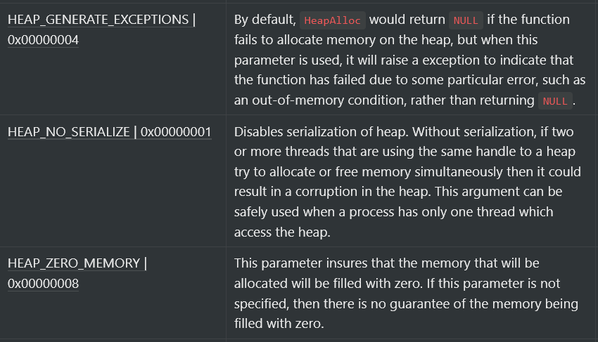
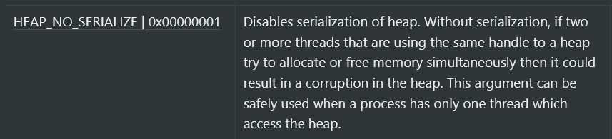

In this blog, we are continuing our series and we are going to study about some basic concepts related to heap on Windows and then we will learn to use some Windows API functions related to the heap. 

# Heap 
Heap is a portion of memory that can be allocated during runtime (i.e. while the program is running).    
Unlike stack, this memory is global, which means, if you allocate 8 bytes on the heap in the function `func1` and save some data inside it, then if you pass the pointer to that data to `func2`, then `func2` will also be use and modify that data. 
Generally, in order to allocate some memory on the heap, the `malloc` function is used and to release allocated memory `free` function is used. Windows API also provides functions such as `HeapAlloc` and `HeapFree` which allows us to allocate and free heap.        

# 1. GetProcessHeap
Whenever a process is created, it gets a heap by default and this heap is never deleted during the process's lifetime. This is called the _default heap_ or the _default process heap_. The default size of this heap is 1 MB but it can be increased by using some linker flags, however, if you fully use the heap, it will automatically expand.    
**This functions is used to get a handle of the _default process heap_ object.** 

#### Function signature
```c    
HANDLE GetProcessHeap();    
```    
There are no arguments for the function as it does nothing fancy, you just call it and it just returns a handle to the heap object.

# 2. HeapAlloc
`HeapAlloc` is used to allocate memory on the heap. This function is similar to the `malloc` function provided by the C runtime library but it provides some extra features. 

#### Function signature 
```c
DECLSPEC_ALLOCATOR LPVOID HeapAlloc(
  HANDLE hHeap,
  DWORD  dwFlags,
  SIZE_T dwBytes
);
```

Forget about the `DECLSPEC_ALLOCATOR` return type. The actual return type of this function is `LPVOID`, if you read my blogs you probably already know what this is. `LPVOID` is just a pointer to a void object, so we can expect this function to return a pointer that will point to the start of the the heap that we are going to allocate. 

#### Arguments
**hHeap**: This argument is used to specify a handle to the heap object that is returned by the `HeapAlloc` function or the `GetProcessHeap` function. 

**dwFlags**: This argument is used to specify different flags while allocating the heap. These are the valid parameters for `dwFlags`:    
    


**dwBytes**: This argument specifies the number of bytes that you want to allocate. 

## Return Value
If the function succeeds, it returns a pointer to the memory block that is allocated on the heap.    
If the function fails and you have not specified `HEAP_GENERATE_EXCEPTIONS` in the `dwFlag` argument, then the function will return `NULL`. If you have specified `HEAP_GENERATE_EXCEPTIONS` in `dwFlags`, it will return an exception code that we can use to get more information about the error, it's similar to what we do with the function `GetLastError` but in this case the function `GetExceptionCode` will be used.

# 3. HeapFree
This function is used to free allocated memory on the heap. This function is similar to the `free` function from the C runtime library.    
    
One thing to note is that when we free a heap block, it is just freed, it is not destroyed. It can be allocated again by the heap manager, until that heap is destroyed by using the `HeapDestory` function. We will see how to destroy heap in the next part of this blog, for now let's focus only on freeing the memory.

#### Function signature
This is the function signature of `HeapFree`:
```c
BOOL HeapFree(
  HANDLE                 hHeap,
  DWORD                  dwFlags,
  _Frees_ptr_opt_ LPVOID lpMem
);
```

The function type is `BOOL`, so we can expect this function to return a boolean value that will tell us whether the memory was freed or not. 

#### Arguments
**hHeap**: Handle to the heap, returned by `HeapCreate` or `GetCurrentHeap`.    

**dwFlags**: This is used to specify some flags while freeing the heap. These are the valid parameters for `dwFlags` argument:    

    

Well yes, this argument has only one parameter, you can specify 0 if you don't want to use this parameter. 

**lpMem**: Address of the memory that you want to free, that is the memory address returned by `HeapAlloc`.

# Examples
Now, we will make some programs with all the functions that we have learnt about in this blog post.

## Example #1
In this example, we will make a program that will get the handle of the default heap using `GetProcessHeap` and then it will allocate some memory on the heap using the `HeapAllocate` function and then it will free that memory using the `HeapFree` function. Here's the code for it:
```c
#include <stdio.h>
#include <Windows.h>

int main() {
    // getting handle to current heap
    HANDLE heap_handle = GetProcessHeap(); 

    // allocating 8 bytes of memory on the heap 
    int* heap_mem = HeapAlloc(heap_handle, HEAP_ZERO_MEMORY, 8);
    printf("The base address of the allocated heap is %x\n", heap_mem);

    // freeing the memory
    int freed = HeapFree(heap_handle, 0, heap_mem);
    // error checking
    if (freed) {
        printf("The memory has been freed successfully!\n");
    } else {
        printf("Was not able to free heap!!");
        exit(1);
    }

    CloseHandle(heap_handle);
    return 0;
}
```
**Explanation**:
First, we got the handle of the default process heap using the `GetProcessHeap` function, then we took that handle and gave it to `HeapAlloc` function as the first parameter and specified `HEAP_ZERO_MEMORY` as the second parameter to tell it that we want the region that's getting allocated to be filled with zeros and then we specified `8` as the third parameter to specify that we want to allocate only 8 bytes of memory then we just printed the address returned by `HeapAlloc` (the base address of the allocated region) and in the end we freed the memory that we allocated by specifying the handle to the default process heap as the first parameter and `0` as the second argument because we have no intetion to touch serialisation and the pointer to the allocated heap as the third parameter then we do some error checking and at last we close the handle that we opened to the heap object.

### Results - #1
This is the output of the code:
```c
The base address of the allocated heap is 940000
The memory has been freed successfully!
```
and indeed, the code worked as expected.    

# Code Example - 2
In this example, we will ask the user to input the amount of heap they want to allocate and then we'll ask them to input some data that will be stored in that region of the heap. Here's the code

```c
#include <stdio.h>
#include <Windows.h>

int main() {
    char* allocation_size;
    char data[999];
    
    // getting handle to current heap
    HANDLE heap_handle = GetProcessHeap(); 

    printf("Enter the amount of heap that you want to allocate (in bytes): ");
    scanf("%c", &allocation_size);
    getchar();

    printf("Enter the data to be stored in the allocated heap: ");
    scanf("%s", &data);

    int* heap_mem = HeapAlloc(heap_handle, HEAP_ZERO_MEMORY, atoi(allocation_size));
    printf("The base address of the allocated heap is %x\n", heap_mem);
    
    // moving data into heap
    puts("Moving input into heap...");
    strcpy((char*)heap_mem, data);

    // printing that data
    printf("The data present on the allocated heap is: %s\n", heap_mem);


    // freeing the memory
    int freed = HeapFree(heap_handle, 0, heap_mem);
    // error checking
    if (freed) {
        printf("The memory has been freed successfully!\n");
    } else {
        printf("Was not able to free heap!!");
        exit(1);
    }

    CloseHandle(heap_handle)
    return 0;
}
```
**Explanation**: The code is very similar to the code from the last example, there are only a few additions. First, we ask the user to input the size of the heap that will be allocated, then we are asking the user for some data that will be moved into the allocated region of the heap, then we actually allocate that heap by using the handle to the default process heap as the first argument, `HEAP_ZERO_MEMORY` as the second and the size specified by the user's input as the size of the heap that will be allocated (`atoi` converts a string into a integer) as the third parameter to `HeapAlloc`.    
Next, we copy the string that the user had given as input into the allocated heap using the `strcpy` (`heap_mem` was converted to `char *` because `strcpy` takes the first argument as a char pointer) and then we print it and in the end, we free the memory that we allocated and close the opened handle.

## Results - 2  
As we are done with writing the code, let's look at the output of the code:
```c
Enter the amount of heap that you want to allocate (in bytes): 50
Enter the data to be stored in the allocated heap: HELLOHEAP
The base address of the allocated heap is 733e30
Moving input into heap...
The data present on the allocated heap is: HELLOHEAP
The memory has been freed successfully!
```
Voila!, the results are same as we expected.

# Summary
There are the key points from the blog:
- Each process on Windows gets a heap by default.
- This heap that is there by default is called the default heap or default process heap.
- The size of the default heap is 1MB.
- This size can increase itself if the whole heap is used.
Besides these points, we learned how to use the `GetProcessHeap` function to get the handle of the _default proces heap_ and how to use this handle to allocate memory on the heap using the `HeapAlloc` function and how to free that memory on the heap by using the `HeapFree` function.    
In the next blog post, we will look at some other heap related functions that allow us to play with the heap a bit more.    
Thank you for reading!

# Resources
- [HeapAlloc - msdn](https://docs.microsoft.com/en-us/windows/win32/api/heapapi/nf-heapapi-heapalloc)
- [HeapFree - msdn](https://docs.microsoft.com/en-us/windows/win32/api/heapapi/nf-heapapi-heaplock)
- [Heap on windows - windows proggramming wikibooks](https://en.wikibooks.org/wiki/Windows_Programming/Memory_Subsystem#Heap_Memory)