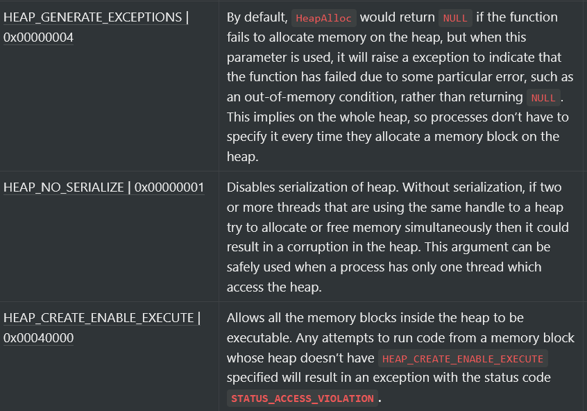

Continuing the last blog post, we will look at some more heap related Windows API functions and as always, we will get to learn a bit more Windows internals.         
Some of the functions that we are going to learn about deal with something called `locks`, let's first understand what is a "lock"... 

## Lock
**Locking is a method used to prevent a resource from being accessed by multiple threads simultaneously.** Once a resource is "locked" by a thread (`t1`), then every other process that tries to _access that resource has to wait_ until that thread (`t1`) is done with it's work and unlocks that resource. 

# 1. HeapLock    
This function **attempts to lock a specified heap.**    
In simplest terms, **If this function successfully locks a heap, then only this function will be able to use that heap until it unlocks it** itself by using the `HeapUnlock` function (described later).    

#### Syntax
The syntax of `HeapLock` function looks like this:
```c
BOOL HeapLock(    
  HANDLE hHeap    
); 
```    
The return type of this function is `BOOL`, so we can expect this function to return whether it failed or succeeded.

#### Argument 
**hHeap**: This is the only argument we need to pass. We need to specify the handle of the heap which we want to lock, which is returned returned by `GetProcessHeap` function.        

#### Return value
If the function succeeds, the return value is nonzero. If the function fails, the return value is zero (0). We can then call `GetLastError` function to get the error code to get more information about the error.

# 2. HeapUnlock
This function does exactly opposite of what `HeapLock` does, it _unlocks_ the resource that was locked previously by `HeapLock`.

#### Function signature
The Function signature of `HeapUnlock` looks like this:    
```c    
BOOL HeapUnlock(    
  HANDLE hHeap    
);    
```    
The return type of this function is also `BOOL`, so we can expect this function to return whether it failed or succeeded.

#### Argument
Same as `HeapLock`, we just have to pass the handle of the heap object and it will unlock the heap.     

#### Return value
Same as the last one. If the function succeeds, the return value is nonzero. If the function fails, the return value is zero (0). We can then call `GetLastError` function to get the error code to get more information about the error.

# 3. HeapCreate
A process a have more than one heap at the same time, and in order to create these new heaps the `HeapCreate` function is used. These manually created heaps differ from the _default process heap_ and can be managed and modified individually.

#### Function signature
```c
HANDLE HeapCreate(
  [in] DWORD  flOptions,
  [in] SIZE_T dwInitialSize,
  [in] SIZE_T dwMaximumSize
);
```
The return type of this function is `HANDLE`, so we can expect this function to return the pointer to the newly created heap.

#### Arguments
**flOption**: This argument is used to specify different options for the heap. This argument can either be 0 (if you don't like any of the options) or one of the following:       
     


**dwInitialSize**: This argument is used to specify the intial size of the heap that we want to create, although this value gets rounded up to the next page boundary. If you do not want to specify the size manually, you can specify `0` and the function will automatically use the size of one page.    
**dwMaximumSize**: This argument is used to specify the maximum size of heap to which it can expand. The heap initially gets created with the size specified in `dwInitialSize` and it can expand upto the size specified in this argument.    
When this argument is set to zero, the heap can expand until it exceeds the amount of memory that's available to the system. This is helpful for applications that allocate large memory blocks on the heap.

#### Return value
The function returns a handle to the newly created heap if it succeeds, otherwise if it fails, it returns `NULL` and as always, `GetLastError` function can be used to get more information about the error.

# 4. HeapDestory
  
# Code Example    
    
In this first example, I have only used the `GetCurrentHeap`. We will use the     
    
```c    
#include <stdio.h>    
#include <Windows.h>    
#include <string.h>    
    
int main() {    
    int heap_size;    
    char data_to_store[2000];    
    char choice[20];    
    int* current_heap = GetProcessHeap(); // Getting the Handle of default Heap.    
    
    printf("How much heap do you want to allocate? (int bytes): ");    
    scanf("%d", &heap_size);    
    
    int* heap = HeapAlloc(current_heap, HEAP_ZERO_MEMORY, heap_size); // Allocating heap of the user supplied size. Filled with zero by default.    
    printf("The handle of heap of this program is %x\n", current_heap);    
    
    printf("Enter the data you want to store in the heap: ");    
    scanf("%s", &data_to_store);    
    memmove(heap, (const void*)data_to_store, strlen(data_to_store)); // Moving the user supplied data into the allocated heap.    
        
    printf("The data stored in heap is: %s\n", heap);    
    
    int freed = HeapFree(current_heap, 0, heap); // Free()'ing the heap.    
    
    if (freed) {    
        printf("The memory has been freed successfully!\n");    
    } else {    
        printf("Was not able to free heap!!");    
        exit(1);    
    }    
        
    return 0;    
}    
```    
    
The code is very simple and straight-forward.        
    
We first get the Handle of the default heap by calling the `GetCurrentHeap` function. The well allocate the amount of heap that user supplied then we ask the user to input the data that they want to move into the allocated heap, then it frees the heap.    
    
Let's run this program and see the output.    
    
The output looks like this:    
    
```    
How much heap do you want to allocate? (int bytes): 8    
The handle of heap of this program is 760000      
Enter the data you want to store in the heap: hello    
The data stored in heap is: hello          
The memory has been freed successfully!    
```    
    
Perfect!...    
    
I guess this is all you need to know about Heap functions in Windows API, I hope you liked this post.    
    
This was all for this one, meet you in the next one!