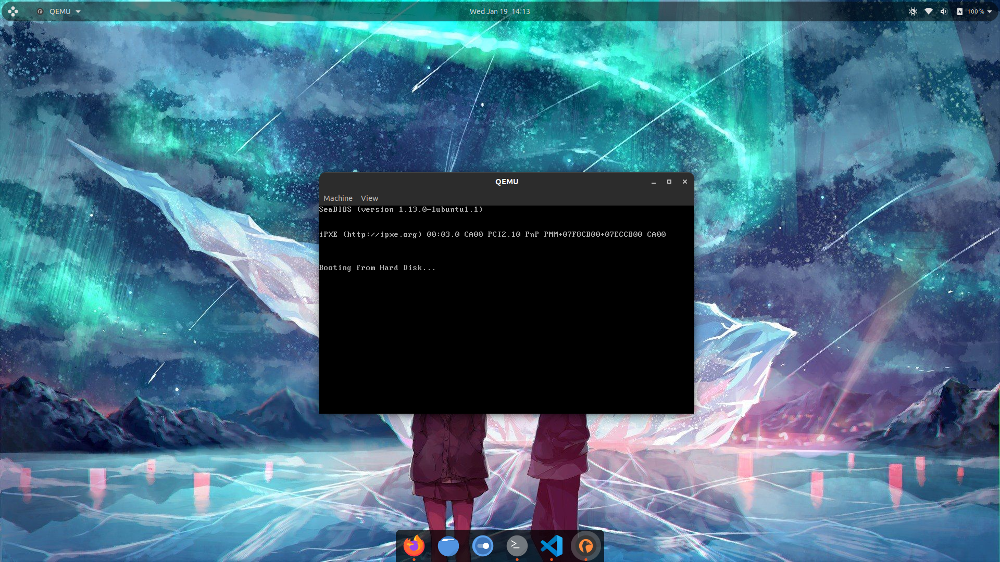
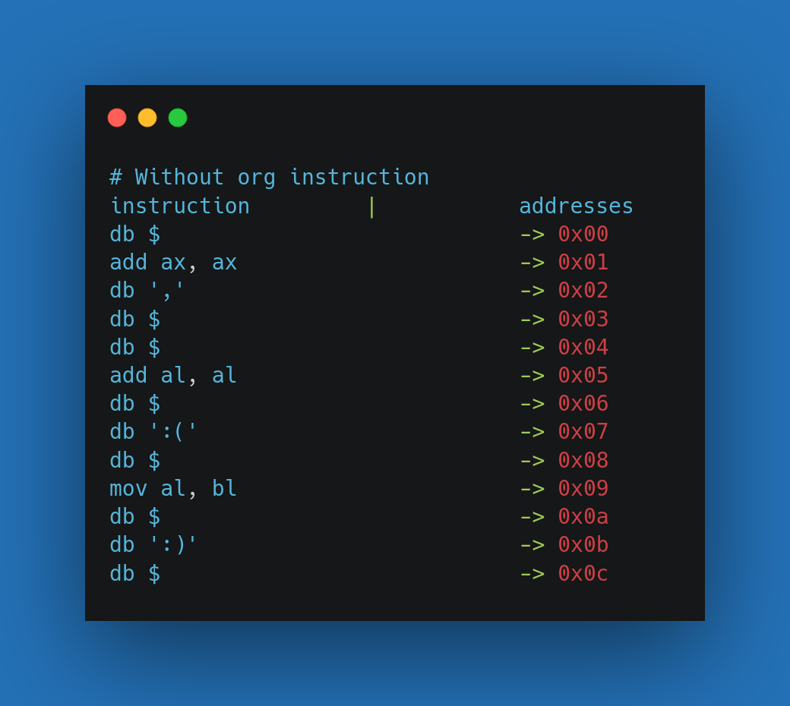
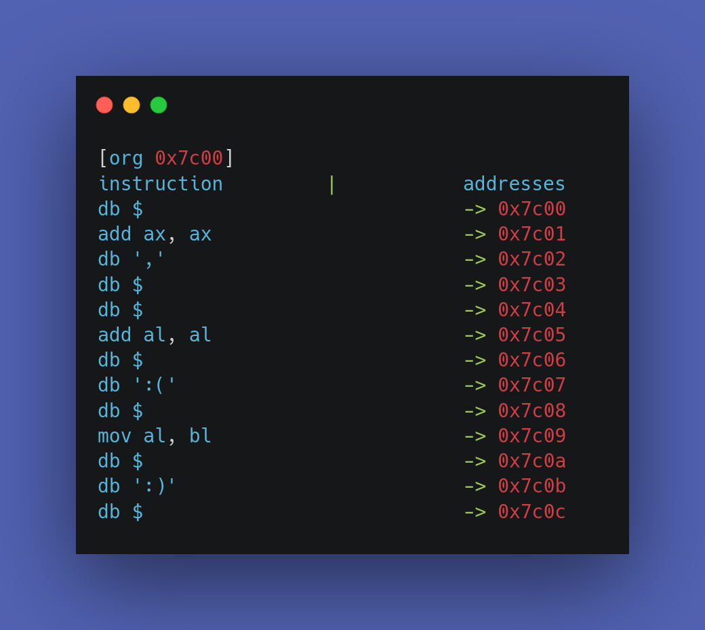
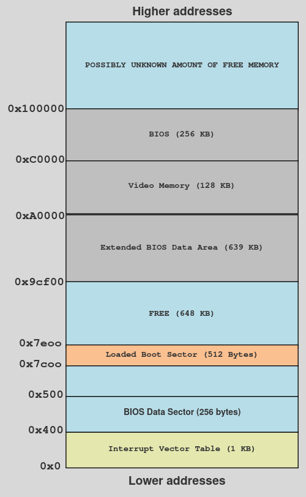
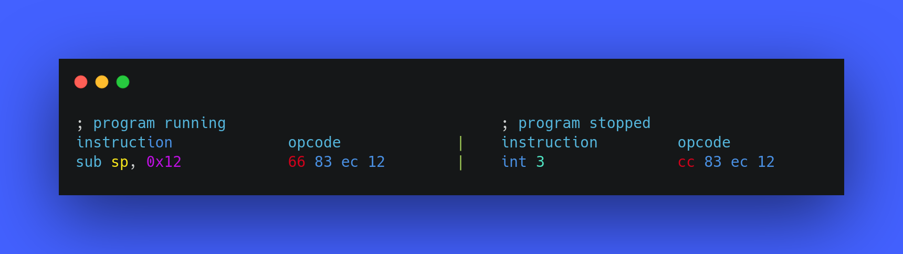
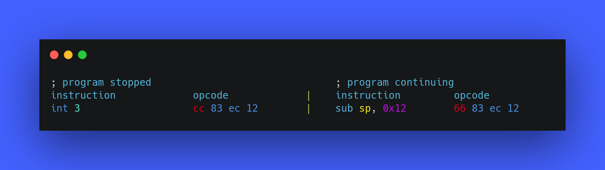
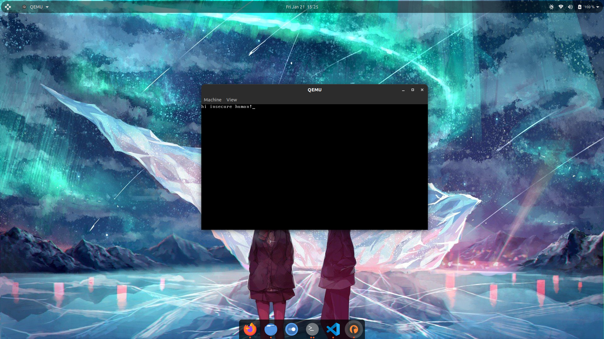

{:.no_toc}
# Introduction

In this post, I am going to teach you how can you write your own Operating System. Although, it won’t be a fully-fleged Operating system (like the one you are using right now to read this post), but it will be a part of an Operating System that would be able to boot and it will give you a brief if not full understanding of the booting process of an Operating System. If you want to take this post seriously, I suggest you to take notes as there is a lot of information combined in this single post and can be uncomfortable to grasp at the same time.    
If you find something difficult to understand from my explanation, you can always check the [resources](#resources) section to get a link to some alternative explanation of that topic.     
I would start this post by introducing you to some important components of the booting process of an Computer.

Table of contents:

* toc
{:toc}

# Firmware

Unless you live under a rock, you might have heard of the term _"Firmware"_ several times, if you didn't then let me introduce you to what a Firmware is.  
The most well known example of firmwares are Basic Input/Output System (BIOS) and Unified Extensible Firmware Interface (UEFI).  
The term itself is actually made up of two fancy words - **FIRM softWARE**. The word _"FIRM"_ means _"something that doesn't change or something that is not likely to change"_ and I know you are a smart person and you know what a software is. The word is nice and all but you are here to learn about the cool technical stuff so let me explain the techincal part of it.
The firmware is stored inside non-volatile memory devices (devices which store sort of permanent data that doesn't change after a system restart) as instructions or data and it is the first thing that the CPU runs after the computer is powered on. Everything that we are learning in this blog post is specific to the BIOS firmware type. 

In order to understand the importance and the uses of a firmware, you would need to understand the boot process (_“boot”_ refers to _“Bootstrap”_) of a computer.  

# The boot process

The booting process is something like this:

- Computer is powered on.
- The Central Processing Unit (CPU) runs the firmware from a specific Read-Only Memory (ROM) chip on your motherboard. The ROM from which your CPU is going to read the firmware depends upon the CPU your system is having.
- The firmware detects several (but not all) hardware components connected to the system, such as network interfaces, keyboards, mouse, and so on, and does some error checking (also known as Power-On Self Test or POST) before activating them.
- The firmware doesn't know what are the properties and details of the Operating System that is about to be going to be ran on the system, So, it transfers it's control to the Operating System and lets it do it's setup. It starts with searching through the available/connected storage devices or network interfaces in a pre-defined order (this order is known as the _"boot device sequence"_ or _"boot order"_) and attempts to find a bootable disk. A bootable disk is a sector (A group of 512 bytes) which contains the magic number (bytes `0xAA, 0x55`). This magic number is also called as the _"boot signature"_. In this sector the byte at index 511 should be `0xAA` and the byte at index 512 should be `0x55`. This bootable disk is also called the Master Boot Record (MBR) and the program stored inside it is called the MBR bootloader or simply bootloader. Remember that this bootloader is a part of the Operating System, so technically, this is part of the process where we are actually booted in the Operating System. This whole process is done after the firmware calls the interrupt 0x19 (more about this later).
- After the firmware has found the bootloader, it loads it into the address `0x7c00` in the RAM and hands over the control to it.
- Now, the bootloader can do whatever it is programmed to do, it may print a nihilist quote and tell you that your life has no meaning or it may just do nothing if it is programmed that way. Jokes aside, while it can be programmed to do anything, the main work it is supposed to be doing is performing several tasks that sets up the environment for the loading of next part (the kernel) of the OS. After performing some tasks like the initialisation of some registers, tables and so on. It reads the kernel from the disk and loads it somewhere in the RAM and handles over the control to it. 
- Now, the kernel has the control over the system. Just like a bootloader, there is no pre-defined tasks for a kernel. Whatever it will do entirely depends upon what it has been programmed to do. For example, this can be seen in the Linux and Windows kernel, they are entirely different and what they will do is too entirely different but they will eventually start the User Interface and allow the user to have the control of the system. If you find this complex, here's an example - Just like everyone in your company does different stuff after they wake up - they may reply drink a cup of chai, they may go for a walk or do anything they want but their end goal is to reach the office on time and start working, a kernel too has the end goal of successfully loading the easy-to-use User Interface part of the OS to the user. Note that this is not the only work of the kernel in the OS, the kernel is an essential part of an OS and also has a lot to do after it has served you the nice UI.

---

# Environment setup

Before diving in, You should have [nasm](https://www.nasm.us/pub/nasm/releasebuilds/2.15rc12/) and [qemu](https://www.qemu.org/download/) installed. I know you probably do not have any of them, so go ahead and install them. Both are available for Windows and Linux.

In linux nasm and qemu can be installed through a single command:

```console
$ sudo apt install nasm; sudo apt install qemu-system-x86
```
---

# Writing our bootloader

As writing a complete kernel from scratch and then writing our own user interface, software, compiler, etc. would be a lot of pain to write in single blog post and even for you to understand, I am going to not do it all in this post and instead of writing the whole OS, we would be only be writing a bootloader, and it actually worths trying to write it, as you will too learn a lot of new things related to bootloaders and Operating Systems.

For now, we will start by writing an endless loop which is not pointless ~~(unlike your life)~~. It will be a function that does nothing more than jumping to itself (looping endlessly). 

```nasm
loop:
    jmp loop 
```
<br>
Here's how you assemble it: 
```console
$ nasm bootsector.asm -f bin -o bootloader.bin
```
The `-f` flag specifies the `format` which is `bin` (binary) in our case, and the `-o` flag is used to name the file in which we want our output to be saved.
<br>        
hexdump of `bootloader.bin`:
```nasm
00000000: ebfe                                     ..
```
The opcode or the hex representaion of these instructions is `ebfe`, it is an infinite loop in assembly, which is exactly what we wanted. 

## Adding some data to our bootloader 
Now that we are done with our endless loop, we will continue to write some more instructions to our bootloader and will eventually make it bootable.

We will first start by writing some data to our bootloader, here's how you do it:
```nasm
loop:
    jmp loop

db 0x10
```
        
hexdump:
```nasm
00000000: ebfe 10                                  ...
```

The `db (data byte)` instruction is used to put a byte "literally" in the executable, that's why you can see 10 being stored in the executable.

## Making our bootloader bootable
The first thing we need to do in order to make this an actual bootable device is to add the the magic bytes at the end of the our bootloader's code (at 511 and 512 index), so that the firmware can actually know that this is a bootable device. This is how we do it:
```nasm
loop:
    jmp loop						; endless loop
db 0x10  						; pointless data
db "You didn't chose to exist." 			; makes sense?

times 0x1fe-($-$$) db 0					; explained later. 0x1fe = 510 in decimal.
dw 0xaa55 						; the magic number.
```
 
The instruction `times 0x1fe-($-$$) db 0` may look scary but it's really easy to understand.    
The instruction can be broken into two instructions: `times 0x1fe-($-$$)` and `db 0`. Let me explain the first one to you then you will be able to make sense of the second one too.    

### The times instruction
The `times` instruction tells the assembler (nasm in this case) to produce multiple (n) copies of a specified instruction. In order to understand this more clearly, let's look at the syntax of `times` instruction:
```nasm
times <n> <instruction> <operand> ...		; n = number of times.
```
One thing you should know is the number of operands depends on the instruction being used.
Here's a simpler use case example of the `times` instruction:
```nasm
times 10 db '1337' 
```
Here, `10` is n, `db` is the instruction and `'1337'` is an operand. This instruction will tell the assembler to make 10 copies of the instruction `db '1337'`.    
Here's the hexdump of the code:
```nasm
00000000  31 33 33 37 31 33 33 37  31 33 33 37 31 33 33 37  |1337133713371337|
00000010  31 33 33 37 31 33 33 37  31 33 33 37 31 33 33 37  |1337133713371337|
00000020  31 33 33 37 31 33 33 37                           |13371337|
00000028
```
As expected, we can notice the string `'1337'` repeated 10 times. It worked just fine.

---


Now, let's move to the original instruction and try to understand the subtraction it's doing.    
Let's start with the subtraction under the bracket `($-$$)`. The `$` operator in assembly (nasm) denotes ~~money~~ the address of the current instruction and `$$` operator denotes the address of the first instruction (beginning of the current section), which in this case, is the address of the definition of the endless loop and whose address would be `0x7C00` (as we know, firmware loads the bootloader at address `0x7C00`).    
It's basically this:
```nasm
addr_of_current_instruction - addr_of_first_instruction_0x7c00 
```
    

This subtraction will return the number of bytes from the start of the program to the current line, which is just the size of the program and it is getting substracted from `0x1fe` (`510` in decimal). Why are we doing this subtraction?    
We are doing this to get the value of bytes that aren't used so that we can fill them with zeros (`db 0`) and then we will successfully be having the magic bytes at `511` and `512` index.    
It can be understood like this:
```nasm
200 - (addr_of_current_instruction - addr_of_first_instruction_0x7c00) ; returns the no. of unused bytes.
```
This value will be passed to `times` instruction as `n` and it already has the instruction (`db`) and operand (`0`), so it will tell the assembler to fill the bytes aren't used with `0` until the 510 index.  
So, it will finally look like this:
```nasm
times 200 -(addr_of_current_instruction - addr_of_first_instruction_0x7c00) db 0
; times 0x1fe-($-$$) db 0
; fills the unused bytes with 0
```

The only thing that is left is to actually put the magic number in the bootloader. It is done by using the `dw 0xaa55` instruction (`dw is same as db but dw is used for words and db is used for bytes`).    
Now, that we are done with the understanding of the bootloader, let's assemble it and look at the hexdump to actually see the result.    
```nasm
00000000: ebfe 1059 6f75 2064 6964 6e27 7420 6368  ...You didn't ch
00000010: 6f73 6520 746f 2065 7869 7374 2e00 0000  ose to exist....
00000020: 0000 0000 0000 0000 0000 0000 0000 0000  ................
00000030: 0000 0000 0000 0000 0000 0000 0000 0000  ................
00000040: 0000 0000 0000 0000 0000 0000 0000 0000  ................
00000050: 0000 0000 0000 0000 0000 0000 0000 0000  ................
00000060: 0000 0000 0000 0000 0000 0000 0000 0000  ................
00000070: 0000 0000 0000 0000 0000 0000 0000 0000  ................
00000080: 0000 0000 0000 0000 0000 0000 0000 0000  ................
00000090: 0000 0000 0000 0000 0000 0000 0000 0000  ................
000000a0: 0000 0000 0000 0000 0000 0000 0000 0000  ................
000000b0: 0000 0000 0000 0000 0000 0000 0000 0000  ................
000000c0: 0000 0000 0000 0000 0000 0000 0000 0000  ................
000000d0: 0000 0000 0000 0000 0000 0000 0000 0000  ................
000000e0: 0000 0000 0000 0000 0000 0000 0000 0000  ................
000000f0: 0000 0000 0000 0000 0000 0000 0000 0000  ................
00000100: 0000 0000 0000 0000 0000 0000 0000 0000  ................
00000110: 0000 0000 0000 0000 0000 0000 0000 0000  ................
00000120: 0000 0000 0000 0000 0000 0000 0000 0000  ................
00000130: 0000 0000 0000 0000 0000 0000 0000 0000  ................
00000140: 0000 0000 0000 0000 0000 0000 0000 0000  ................
00000150: 0000 0000 0000 0000 0000 0000 0000 0000  ................
00000160: 0000 0000 0000 0000 0000 0000 0000 0000  ................
00000170: 0000 0000 0000 0000 0000 0000 0000 0000  ................
00000180: 0000 0000 0000 0000 0000 0000 0000 0000  ................
00000190: 0000 0000 0000 0000 0000 0000 0000 0000  ................
000001a0: 0000 0000 0000 0000 0000 0000 0000 0000  ................
000001b0: 0000 0000 0000 0000 0000 0000 0000 0000  ................
000001c0: 0000 0000 0000 0000 0000 0000 0000 0000  ................
000001d0: 0000 0000 0000 0000 0000 0000 0000 0000  ................
000001e0: 0000 0000 0000 0000 0000 0000 0000 0000  ................
000001f0: 0000 0000 0000 0000 0000 0000 0000 55aa  ..............U.
```
As expected, we have filled the unused bytes with zeros and the last two bytes with the magic number (the order is different due to endianness). Now our bootloader and actually a bootloader and ready to work.

### Booting into our bootloader 
To boot into it, make sure you have assembled your bootloader code with nasm.

Run this command:
```
qemu-system-x86_64 bootsector.bin
```
After you run this, if will see a window of qemu which has some initialization text and then it is blank it means your bootloader works perfectly because we just programmed it to loop so it just doing that.
Here's how the window looks like:
{:.no_toc}
{: .align-center}

---

## The final code
We are finally at almost the end of the blog post, and we will now add the final features to our bootloader. These features are not going to be anything fancy, we are only going to make it display the text that we are entering.    
Here's the code for it:
```nasm
[org 0x7c00]

mov bp, 0xffff
mov sp, bp

call set_video_mode
call get_char_input

jmp $

set_video_mode:
	mov ah, 0x00
	mov al, 0x03
	int 0x10
	ret

get_char_input:
	xor ah, ah
	int 0x16

	mov ah, 0x0e
	int 0x10

	jmp get_char_input

times 0x1fe-($-$$) db 0
dw 0xaa55
```
### The org directive
The difference between an instruction an directive is that An instruction is directly translated to something the CPU can execute. A directive is something the assembler can interpret and use it while assembling, it does not produce any machine code.    
The first line may look a bit complex because unlike other instructions, it has brackets around it, but there's nothing to worry about, you can just forget about the brackets and focus on the actual directive. It is `org 0x7C00`. Here's the explanation:    
As we know, bootloaders get loaded at the memory address `0x7C00` but the assembler don't know this, that is why we use the `org` directive to tell the assembler to assume that the address of beginning of our code (base address) is `<operand>`, which is `0x7C00` in this case. After the assembler knows the base address of the program, every address that the assembler use while assembling the code will be relative to the base address that we have defined. For example, if we do not use this directive, the assembler will assume that the base address to be `0x00` and the address of every function and instruction will be calculated like this: 
```nasm
0x00+relative_addr_of_function
; base_addr + relative_addr_of_function
; base_addr + relative_addr_of_instruction
``` 
and these address won't work on the runtime of our bootloader as it will not be loaded at that address, that is why we need to use the org directive.    
Visual comparison of effects of using and not using the org directive:    
<br>


### Setting up the registers. 
The next thing we do is setting the correct values for registers.    
The first register we set up is the `bp` (`base pointer`) register to the address `0xffff` and then copy it to `sp` (`stack pointer`). Hold up!, Why this address?    
In order to understand this, we first need to look at the memory layout of the system when it's in the booting process. Here is how it looks like:    

{: .align-center} 
**Memory layout of the system while booting.**
{: .text-center}
As you can see, the memory address that we are setting the base pointer is in the free memory that is after the memory address where our bootloader will be loaded (`0x7e00`) and before the other section of memory which starts at `0x9cf00`. We have set it to `0xffff` because if we had set it anywhere else (in some non-free memory) then it could possibly overwrite the other data that is around it as the stack increases it's size whenever data is pushed into it.    

### Interrupts.
The next line of code after the setting up of registers is of a `call` instruction which is calling the function `set_video_mode`. Here's the code of the function: 
```nasm
set_video_mode:
	mov al, 0x03
	mov ah, 0x00
	int 0x10
	ret
```
The first two lines are pretty basic, they are just moving the constant `0x03` and `0x00` into `al` and `ah` register but then we have a new instruction, which is the `int` instruction. The `int` instruction is used to generate a software interrupt. So, what is an interrupt?    
Interrupts allow the CPU to temporarily halt (stop) what it is doing and run some other, higher-priority instructions before returning to the original task. An interrupt could be raised either by a software instruction (e.g. int 0x10) or by some hardware device that requires high-priority action (e.g. to read some incoming data from a network device.    
Each interrupt has a different number assigned to it, which is an index in the Interrupt Vector Table  (IVR) which is basically a table that stores these interrupts as indexes to vectors (memory address or pointers) which point to Interrupt Service Routines (ISR). ISRs are initialised by the firmware and they are basically machine code that run differently for each interrupts, they have a sort of a long switch case statement with code to be used differently for different arguments. You can think IVT as a simple hash table (dictionary) in which each index holds a memory address to a function. Here's an example:
```python
IVT = {
	1: 0x0...,
	2: 0x0...,
	3: 0x0...,
	4: 0x0...,
	5: 0x0...,
	6: 0x0...,
	7: 0x0...
	...
}
```
#### The most popular interrupt 
If you have ever debugged a program, you might already know what a breakpoint is, it's simply you asking the debugger to stop the program at some point while it's running and the debugger does it's job. But, How do debuggers even make the program stop at while it's running?    
They use the interrupt 3, which is specially made for debuggers to stop a running process.
```nasm
int 3
```

How do they use this interrupt to pause a program?    
Debuggers replace the opcode of the first opcode of the currently running instruction with the opcode of `int 3` which is just a one-byte opcode `cc`.    
Here's an example:

{: .align-center}

As `int 3` has just a single byte opcode, it makes the task very fast and easy for debuggers. When the `int 3` instruction is executed, it's index is checked in the IVT and then it's ISR is located and it starts running. The ISR then finds the process which needs to get paused, pauses it and notifies the debugger that the process has been stopped, and once the debugger gets this notification, it allows you to inspect the memory and the registers of the process which is getting debugged by the debugger. In order to allow the continuation of the process which was previously paused, the debugger replaces the `cc` opcode with the original opcode which it was replace with and the program continues from the place where it was stopped. Example:    



I hope this section helped you understand the real world usage and implementation of an software interrupt, and now you also know how a debugger makes the breakpoint a thing. 

#### int 0x10
Now, you have a good understanding of interrupts and you have also seen an real world example of it, let's now understand the usage of the interrupt that is present in the `set_video_mode` function, the interrupt `0x10`.
The interrupt `0x10` has video/screen related modification functions. In order to use different functions, we set the `ah` and `al` registers together to different values. These are the values that to which the `ah` register can be set:  
- AH=0x00: Video mode.
- AX=0x1003: Blinking mode.
- AH=0x13: Write string.
- AH=0x03: Get cursor position.
- AH=0x0e: Write Character in TTY Mode.

```nasm
set_video_mode:
	mov ah, 0x00
	mov al, 0x03
	int 0x10
	ret
```
Explanation: 
The `mov` instruction is setting the value of the `ah` register to `0x00`, which is basically asking it's ISR to set the video mode to a mode which is specified in the `al` register, and these are the supported video modes with the values for `ah` register:
- AL=0x00 - text mode. 40x25. 16 colors. 
- AL=0x03 - text mode. 80x25. 16 colors.
- AL=0x13 - graphical mode. 40x25. 256 colors. 320x200 pixels.

So, both registers combined are basically asking the ISR of interrupt `0x10` to set the video mode of the screen to text mode, which has the size `80x25` and supports 16 colors and that is the only motive of this function.

#### int 0x16.
The other function we are left with is `get_char_input`. In this function, we have another interrupt, which is interrupt `0x16`.    
The interrupt `0x16` is used for basic keyboard related function. These are the some values that can be set in the `ah` register to use different keyboard functions:    
- AH = 0x00 - Read key press.
- AH = 0x01 - Get state of the keyboard buffer.
- AH = 0x02 - Get the State of the keyboard.
- AH = 0x03 - Establish repetition factor.
- AH = 0x05 - Simulate a keystroke
- AH = 0x0A - Get the ID of the keyboard.

##### Implementation of interrupts into something useful
    
```nasm
get_char_input:
	xor ah, ah
	int 0x16

	mov ah, 0x0e
	int 0x10

	jmp get_char_input
```
The first thing done in the function's code is the xoring of the `ah` register with itself, which is basically the same as `mov ah, 0x00` but xoring a register with itself is believed to be faster and less CPU expensive, so I used it.    
After setting `ah` to zero, it will call the interrupt `0x16`, whose ISR will then read the keystroke from the keyboard and store it into the `al` register.    
After that, it sets the `ah` register to `0x0e` and calls our good old interrupt `0x10`, but this time it is not setting the video mode to something as the `ah` register is not set to `0x00`. If you read the functions of the interrupt `0x10` again, you will find that `ah = 0x0e` asks it's ISR to "write a character in tty mode" which basically means "write a character to the screen". The character which this ISR will print will be taken from the `al` register. So, these two interrupts are together reading the character from the screen (using interrupt `0x10`) and printing it onto the screen (using intterupt `0x16`).    
After this reading of character, the function is simply calling itself (like an infinite loop) to continue what it's doing forever until it's manually stopped.


##### Our bootloader in action 
The final thing we are left with is to see our bootloader in action, so let's do it.
Assemble the code:    
```console
$ nasm bootsector.asm -f bin -o bootloder.bin
```
Run it with qemu:    
```nasm
qemu-system-x86_64 bootsector.bin
```
Now, you should have a blank window of qemu. You can now type anything and it'll display it to the screen and that is all it has to it. 



# Summary
We started this blog post by understanding the [boot process](#the-boot-process) of a computer, then we learnt about some new and assembly instructions and then we learned about what [interrupts](#interrupts), how they work and then we learnt about [how](#the-most-popular-interrupt) debuggers implement breakpoints using interrupts and lastly we learnt how the [interrupt 0x10](#int-0x10) and [interrupt 0x16](#int-0x16) can be used and [how](#implementation-of-interrupts-into-something-useful) can we implement them to read data from the screen and print it.

# Author notes
This post really took me so much of my time, efforts and understanding of different aspects of an Operating System. I tried the best way to explain everything and I hope that you also learnt so many new things throughout this blog post.    
If you think this thing feels fascinating to you and you want to build your own fully-fledged Operating system, then you can continue learning OS dev and to make your lazy life easier, I have linked to different places where you can learn OS dev in the [resources](#resources) section.    

# Resources
- [Operating system development series](http://www.brokenthorn.com/Resources/OSDev1.html)
- [Operating systems: from 0 to 1](https://raw.githubusercontent.com/tuhdo/os01/master/Operating_Systems_From_0_to_1.pdf)
- [Operating system development by Nick Blundell (University of Birmingham, UK)](https://www.cs.bham.ac.uk/~exr/lectures/opsys/10_11/lectures/os-dev.pdf)
- [Little book on Operating System development](https://littleosbook.github.io/)
- [Firmware - wikipedia](https://en.wikipedia.org/wiki/Firmware)
- [BIOS vs UEFI](https://www.freecodecamp.org/news/uefi-vs-bios/)
- [Boot sequence (process) at osdev wiki](https://wiki.osdev.org/Boot_Sequence)
- [Booting in operating system](https://www.javatpoint.com/booting-in-operating-system)
- [Booting - wikipedia](https://en.wikipedia.org/wiki/Booting)
- [MBR boot process](https://neosmart.net/wiki/mbr-boot-process/)
- [Bootloader - osdev wiki](https://wiki.osdev.org/Bootloader)
- [Bootloader wikipedia](https://en.wikipedia.org/wiki/Bootloader)
- [Power-on Self Test - POST](https://en.wikipedia.org/wiki/Power-on_self-test)
- [Purpose of base pointer - stackoverflow](https://stackoverflow.com/questions/41912684/what-is-the-purpose-of-the-rbp-register-in-x86-64-assembler)
- [what does the assembly instruction 'db' actually do? - stackoverflow](https://stackoverflow.com/questions/17387492/what-does-the-assembly-instruction-db-actually-do?rq=1)
- [Difference between directive and instruction - quora](https://www.quora.com/What-is-the-difference-between-an-instruction-and-a-directive-in-assembly-language)
- [The org directive in assembly](https://www.keil.com/support/man/docs/a51/a51_st_org.htm)
- [Interrupts guide](https://web.archive.org/web/20190520163253/http://www.ousob.com/ng/asm/ng633bd.php)
- [Interrupt Vector Table](https://microcontrollerslab.com/what-is-interrupt-vector-table/#What_is_Interrupt_Vector_Table_IVT)
- [INT instruction x86](https://en.wikipedia.org/wiki/INT_(x86_instruction))
- [Guide to interrupt 0x10](http://www.ctyme.com/intr/int-10.htm)
- [Interrupt 0x10 assembly](https://4beginner.com/8086-assembly-language-int-10h-video-interrupt)
- [Interrupts and Interrupt Service Routines](https://www.youtube.com/watch?v=eI7Orib5giw)
- [Interrupt Service Routines osdev wiki](https://wiki.osdev.org/Interrupt_Service_Routines)
- [Differences between: INT 10H , INT 16H, INT 21H - stackoverflow](https://stackoverflow.com/questions/30187367/differences-between-int-10h-int-16h-int-21h)