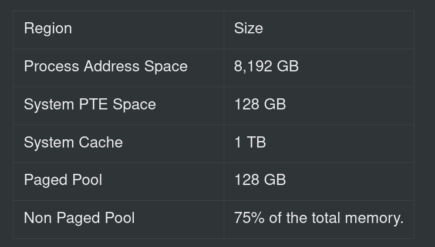
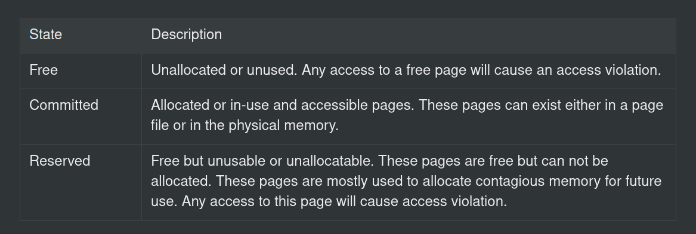
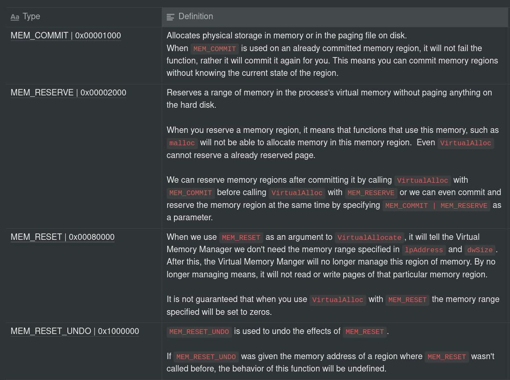
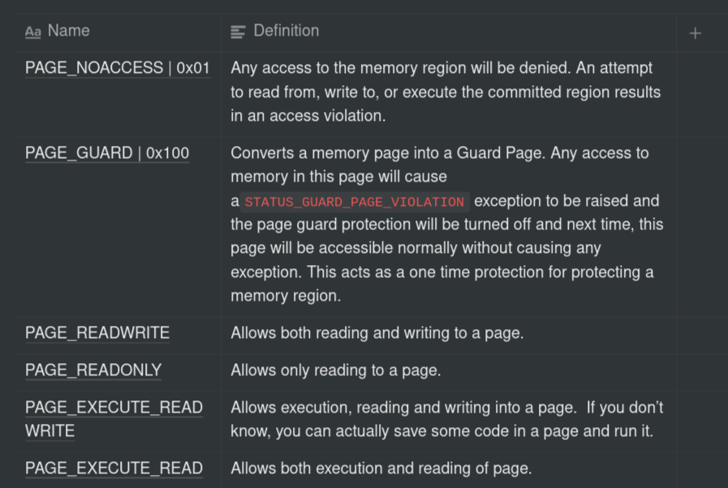
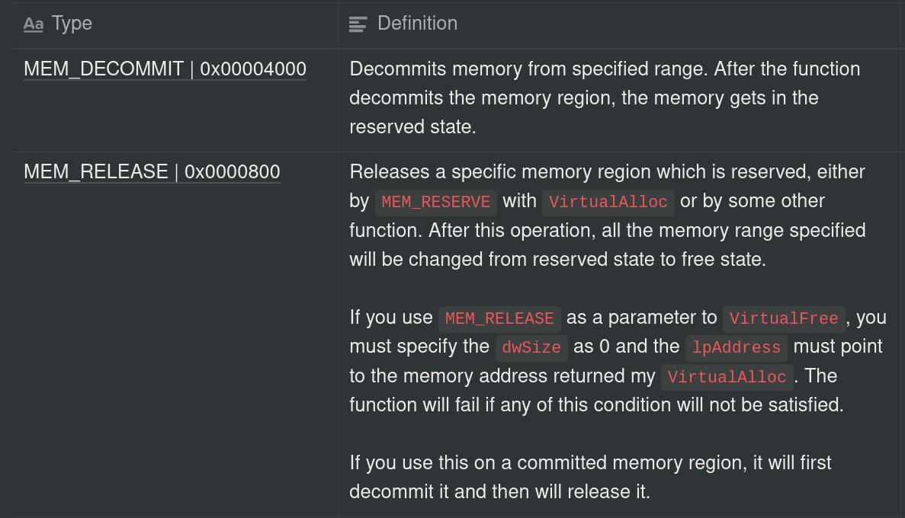

{:.no_toc}
# Introduction
If you have ever explored Windows Internals or just the internal workings of an Operating System or Computer, you must have heard of the term "Virtual Memory" or "Paging" somewhere because these are some of the most important concepts of an Operating System and these are the concepts which we are going to explore in this blog post. Of course, I won't be able to cover the whole concepts but I'll try to give you basic understanding of every concept I will talk about but I will link to the resources that explain each concept in deep in the [resources](#resources) section.

Table of contents:

* toc
{:toc}


# Virtual Memory
If you don't know, 64 bit systems only use 48 bits for addressing out of their total 64 bits. Why?    
Because, if all 64 bits are allowed, the system will be able to address up to 16 exabyte (EB) of memory (1 EB = 1000000 terabytes) and of course, none of the system can use or need that much memory and another reason behind this is the memory manager can't manage this much memory at the same time. This is why only 48 bits of addressing is allowed and it allows the system to address 256 TB of memory, which is still a lot.
We generally use the term "memory" (in context of computing) to refer to the RAM or some data stored in the RAM but behind the scenes, there is a lot going on that actually makes memory a thing and one of the many component behind this us virtual memory.      
If you are a bit familiar with this internals stuff and assembly, you might already know how does a memory address look like. It's like this:
```nasm
0xFFFFDEADC0DE
```
yeah, like that. This is an example of a virtual memory address (or simply a virtual address). These addresses don't actually point to the actual physical RAM installed on your computer, but they are basically a reference to the actual location in the physical RAM (aka physical memory address). These virtual memory address are translated into physical memory addresses by the combined workings of both the CPU and the Memory Management Unit (MMU).    
One of the main reasons of using virtual memory is that without the implementation of virtual memory, when a process runs on an OS, it can _very_ possibly overwrite the data of other processes or even the data of the Operating System itself, as it is also stored in the physical memory which can lead to a whole system crash. Besides this, there are a lot of other benefits that the virtual memory provides over physical memory and that is the reason why most architectures today use it.    

# Paging
Implementation of virtual memory by the Memory Management Unit is known as paging. Windows uses two types of paging which are known as **Disc Paging** and **Demand Paging** with clustering.    
Virtual memory and physical memory both are divided into 4KB chunks (regions/parts), these chunks are called Pages (virtual memory chunks) and page frames (physical memory chunks). There are also large pages and huge pages but I won't talk about them in this blog post.    
In disc paging, whenever there is not enough memory left in the physical memory (RAM), the memory manager (explained later) moves pages from the RAM to special files called page files and this process of moving data from RAM to disc is called paging out memory or swapping. Moving pages from RAM to page files frees the RAM and this free memory can be used by new processes for their work. But, what happens to the paged out memory?    
Whenever some code (instruction) tries to access some data that is not in the physical memory but is paged out, the MMU generates a _page fault_ which is then handled by the OS, the OS takes that page from the disk and moves it back into the physical memory and restarts the instruction that wanted to access that memory. However, in clustering, instead of bringing back only the page that the fault requested, the memory manager also brings the pages surrounding the page that the fault requested.    
In demand paging, whenever a process tries to allocate memory, the memory manager doesn't really allocate any memory but it still returns a pointer to some memory, which is actually not yet allocated, it gets allocated only when after it is accessed. Memory is not allocated -> Process accesses the non existent memory so page fault happens -> Windows allocates the memory and allows you to use it. This method is used because programs may allocate memory that they will never access or use and having this kind of pages in the memory will only waste the demand paging allows the system to save unused memory.    
Each 64 bit process on Windows is allowed to use 256 TB of virtual memory addresses but this memory is divided into different sized regions, some of which is used by the system and some of it is allowed to be used by a process. Here is a diagram of the division:




## Page states
A page can be in one of the three states:


{: .align-center}

# Memory Manager in Windows
All the management of the virtual memory and virtual addresses is done by the Memory Manager, which is a part of the Windows executive (kernel component). Here are the specific tasks of the memory manager:
- Translating a virtual memory address to a physical memory address.
- Performing paging.
- Allocation, Reservation, Freeing of virtual memory.
- Handling page faults.
- Managing page files.
- Provides a userland API for allocation, reservation and freeing of virtual memory.

# Memory-Mapped files
A memory-mapped file is a special region in virtual memory that contains the contents of a file, this allows processes to treat the the contents of a file like a normal region in the memory.    
There are two types of memory-mapped files in Windows:
- Persisted memory-mapped files: These are the files that are associated (connected) with an actual file on the disk. After the last process has done it's work with the memory-mapped file, the mapped file is written to the original file to which the memory-mapped file was associated with.
- Non-Persisted memory mapped files: These files are not associated with any file on the disk and are mostly used for inter-process communications (IPC). After the last process had done it's work with the memory-mapped file, it's content is lost.

# Page sharing
There are pages that are shared with different processes and these pages are called shared pages. Shared pages are mostly used to share DLLs that most processes on Windows require which saves RAM as the system doesn't have to allocate same DLLs for each process, an example of this is `kernel32.dll`. Shared pages are essentially just _shared memory-mapped pages_ which are associated with DLLs or some other shareable data.

# The Virtual Memory Management API
This API is provided by the memory manager of Windows. This API allows us to allocate, free, reserve and secure virtual memory pages. All the memory related functions in the Windows API reside under the `memoryapi.h` header file. In this particular post, we will see the `VirtualAlloc` and `VirtualFree` functions in depth.

# 1. VirtualAlloc
The `VirtualAlloc` function allows us to allocate private memory regions (blocks) and manage them, managing these regions means reserving, committing, changing their states (described later). The memory regions allocated by this function are called a "private memory regions" because they are only accessible (available) to the processes that allocate them. Memory regions allocated with this function are initialised to 0 by default.     

#### Function signature
This is the function signature of this function:
```c
LPVOID VirtualAlloc(
  LPVOID lpAddress,
  SIZE_T dwSize,
  DWORD  flAllocationType,
  DWORD  flProtect
);
```

#### Arguments
The return type of this function is `LPVOID`, which is basically a pointer to a void object. `LPVOID` is defined as `typedef void* LPVOID` in the `Windef.h`. In simple words, `LPVOID` is an alias for `void *`. `LP` in `LPVOID` stands for long pointer.    

**lpAddress**: This argument is used to specify the starting address of the memory region (page) to allocate. This address is obtained from the return value of the previous call to this function. If we don't know where to allocate memory (as if we have not called this function previously), we can simply specify `NULL` and the system will decide where to allocate the memory. If this address is specified, the next argument (`dwSize`) will be ignored. If the address specified is from a memory region that is inaccessible or if it's an invalid address to allocate memory from, the function will fail with `ERROR_INVALID_ADDRESS` error.

**dwSize**: This argument is used to specify the size of the memory region that we want to allocate in *bytes*. If the `lpAddress` argument was specified as `NULL` then this value will be rounded up to the next page boundary.

**fAllocationType**: This argument is used to specify which type of memory allocation we need to use. Here are some valid types as defined in the Microsoft documentation:

{: .align-center}

If you are confused about the hex values which are written after every value, they are basically the real value of the constants (i.e. `MEM_COMMIT`, `MEM_RESERVE`, etc). For example, if we use `MEM_COMMIT`, then it will be converted to `0x00001000` and same with all other values.

#### What does committing memory actually means?
In the table of types and definitions, I have described `MEM_COMMIT` (which is used to commit virtual memory) terribly, so let me explain what committing memory actually means in a better way.    
When you commit a region of memory using `VirtualAlloc`, due to the use of demand paging, the memory manager doesn't actually allocate the memory region, neither on the physical disk nor in the Virtual Memory, but, when you try to access that memory address returned by the `VirtualAlloc` function, it causes a [page fault](https://www.geeksforgeeks.org/page-fault-handling-in-operating-system/) which causes a series of events and eventually the system allocates that memory region and serves it to you. So, until there's an access request to the memory, it's not allocated, there's just a guarantee by the memory manager that there exists some memory and you can use them whenever you want.

The types which are used rarely can be found [here](https://docs.microsoft.com/en-us/windows/win32/api/memoryapi/nf-memoryapi-virtualalloc#arguments).

**flProtect**: This argument is used to specify the memory protection that we want to use for the memory region that we are allocating.    
These are the supported parameters:

{: .align-center}

These are only the most used memory protection constants, the full list can be found [here](https://docs.microsoft.com/en-us/windows/win32/memory/memory-protection-constants).

## Return value
If the function succeeds, it will return the starting address of the memory region that was modified or allocated. If the function fails, it will return `NULL`.

# 2. VirtualFree
This function is basically used to free the virtual memory that was allocated using `VirtualAlloc`.

## Syntax
This is the syntax of `VirtualFree`:

```c
BOOL VirtualFree(
  LPVOID lpAddress,
  SIZE_T dwSize,
  DWORD  dwFreeType
);
```
As you can see, the return type of this function is `BOOL`, it means that it will either return true (success) or false (fail).    

## Arguments
**lpAddress**: As we know, this argument is used to specify the starting address of the memory region (page) which we want to modify (free in this case), but unlike the first time, we cannot specify `NULL` as an argument because obviously, the function cannot free a memory region whose address it doesn't know. 

**dwSize**: We also know about this argument, it is used to pass the size in *bytes* of the memory region which we want to modify. Here, we will use it specify the size of the memory region that we want to free.

**lpAddress**: This argument is used to specify the type which we want to use to free the memory. It may be a bit confusing to you but looking at these types and their definition will clear your confusion:     
{: .align-center}

## Return value
If the function does its job successfully, it returns a nonzero value. If the function fails, it will return a zero (0).

# Examples
As we have looked into all the explanation, now it's time to write some code and clear the doubts.

## Example #1 - VirtualAlloc
Let's start with taking example of `VirtualAlloc`. We will write some code which will commit 8 bytes of virtual memory.    
First we'll start by including the needed libraries:
```c
#include <stdio.h>
#include <memoryapi.h>
```

Now, we'll define a main function that will use the `VirtualAlloc` function to commit 8 bytes of Virtual Memory. We will specify the `lpAddress` argument as `NULL`, so that the system will determine from where to allocate the memory. Here is how the code looks like:
```c
#include <stdio.h>
#include <memoryapi.h>

int main(){
	int *pointer_to_memory = VirtualAlloc(NULL, 8, MEM_COMMIT, PAGE_READWRITE); // commit 8 bytes of virtual memory with read write permissions. 
	printf("%x", pointer_to_memory); // print the pointer to the start of the region.
  return 0;
}
```
Do you think something is missing from the code?    
It's the `VirtualFree` function. Whenever we allocate any kind of memory, we have to free it so that it can be used by other processes on the system.

Now it's time to implement the `VirtualFree` function, so here is it:
```c
#include <stdio.h>
#include <memoryapi.h>

int main(){
    int *pointer_to_memory = VirtualAlloc(NULL, 8, MEM_COMMIT, PAGE_READWRITE); // commit 8 bytes of virtual memory with read write permissions. 
    printf("The base address of allocated memory is: %x", pointer_to_memory); // print the pointer to the start of the region.
    VirtualFree(pointer_to_memory, 8, MEM_DECOMMIT); // decommit the memory region.
    return 0;
}
```
Until this point, the working of the code must be clear to you, but if it's not, here's the line-by-line explanation of the code.    
First, there's a variable which is pointing to the memory address returned by `VirtualAlloc`. We have passed four parameters to the `VirtualAlloc` function.     
The first parameter is `NULL`, by passing `NULL` as a parameter, we are telling the function that the starting point of the memory region should be decided by the system.    
The second parameter is the size of the memory region that we want to allocate in bytes, which is `8` bytes.    
The third parameter is the allocation type, we have specified that we want to commit the memory. After we commit a memory region, it is available to us for our use but it's not actually allocated until we access it for the first time.    
The last parameter is `PAGE_READWRITE`, which is telling it that we want the memory region to be readable and writeable.     
The we are printing virtual memory address returned by `VirtualAlloc` function as a hex value.    
In the end, we are decommitting the memory region that we allocated by using the `VirtualFree` function.    
The first parameter is the base address of the memory region that we allocated.    
The second parameter is the size of memory region in bytes, we specified `8` while allocating it so the we'll specify `8` while deallocating it.   
Then we have specified the type of deallocation. As we are using `MEM_DECOMMIT`, the memory region will be reserved after it gets decommitted, which means that any other function will not be able to use it after you decommit it until you use `VirtualFree` function again to release the memory region.

### Results #1
As we are almost done with everything, let's compile and run the code. I suggest you to write the code by yourself and see the result. This is the that result that I got after I ran it:    
```console
$ ./vmem-example.exe
The base address of allocated memory is: 61fe18
```
Cool, right?    
We have just used the `VirtualAlloc` function to allocate 8 bytes of virtual memory and we freed it by ourselves. Now let's add some data to the allocated virtual memory and print it. 

## Example #2 - VirtualAlloc
Now let's save some data inside the virtual memory that we allocated:
```c
#include <stdio.h>
#include <memoryapi.h>

int main(){
    int *pointer_to_memory = VirtualAlloc(NULL, 8, MEM_COMMIT, PAGE_READWRITE); // commit 8 bytes of virtual memory with read write permissions. 
    printf("The base address of allocated memory is: %x", pointer_to_memory); // print the pointer to the start of the region.
    memmove(pointer_to_memory, (const void*)"1337", 4); // move "1337" string into the allocated memory.
    printf("The data which is stored in the memory is %s", pointer_to_memory); // print the data from the memory.
    VirtualFree(pointer_to_memory, 8, MEM_DECOMMIT); // decommit the memory region.
    return 0;
}
```

The `memmove` function is used to move data from one destination to other. The first argument to this function is the destination memory address where you want to move the data and the second argument is the data that will be moved and the last and third argument is the size of data. Here, we have copied "1337" to the memory our virtually allocated memory. If you're confused about the type conversion, it's used because `memmove` takes second argument as a `const void*` and we can't directly pass `char` array to it.

### Results #2
Let's compile and run the code. This is the output that we'll get:

```console
$ ./vmem-example.exe
The base address of allocated memory is: 61fe18
The data which is stored in the memory is 1337
```
looks even more cool :D!    

# Summary
We learnt a lot about virtual memory in this post, we first looked at how it is basically "virtual" memory which points to "physical" memory then we learnt about paging on windows and different paging schemes that Windows' memory manager uses then we got to know that a page is basically a memory region of 4KB, then we had look at two memory management related functions which allow us to modify virtual memory by allowing us to allocate and free it. I hope you enjoyed the blog and it wasn't boring, any suggestions and constructive criticism is welcome!    
Thank you for reading!

# Resources
- [An awesome blog on virtual memory with explanation of the translation of virtual memory into physical memory](https://connormcgarr.github.io/paging/)
- [Memory Management : Paging](https://medium.com/@esmerycornielle/memory-management-paging-43b85abe6d2f)
- [x86 paging tutorial](https://cirosantilli.com/x86-paging)
- [Why are programs not written using physical addresses? - stackoverflow](https://stackoverflow.com/questions/34072879/why-are-programs-not-written-using-physical-addresses)
- [VirtualAlloc - msdn](https://docs.microsoft.com/en-us/windows/win32/api/memoryapi/nf-memoryapi-virtualalloc)
- [VirtualFree - msdn](https://docs.microsoft.com/en-us/windows/win32/api/memoryapi/nf-memoryapi-virtualfree)