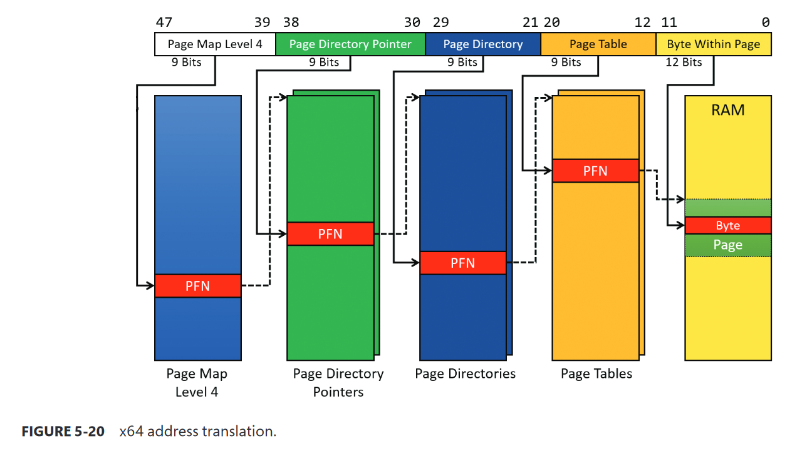
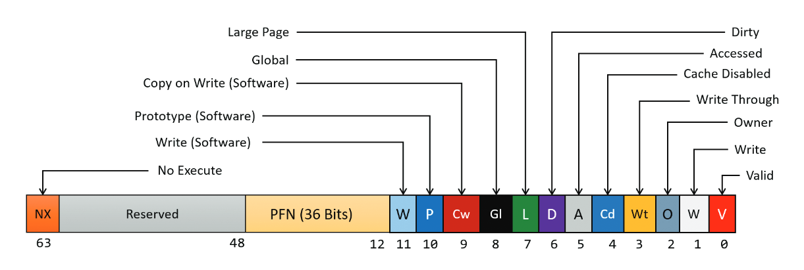

We learned about the fundamentals of virtual memory management in the last post, as well as two Windows API functions that allow us to allocate virtual memory (`VirtualAlloc`) and free it (`VirtualFree`).    
In this blog, we'll continue our exploration of virtual memory management in Windows by learning about the how does a virtual memory address translate to a physical address, the structure of a page table in memory (explained later), what information it contains, and how we can use Window API functions to query that information and some other internals regarding the workings of virtual memory in Windows.    

Table of contents:

* toc
{:toc}

# Translation of virtual memory address 
When a virtual memory address gets translated, it goes through several different translation layers where each time it's translated, it points to a new table (which can be thought of as a structure) which also points to another table and this process is repeated until it finally gets translated into an address in the actual physical memory (RAM). The **translation** of these pages is done by the Memory Management Unit (MMU) of the CPU and their **management** is done by the Memory Manager (a component of the Windows OS). On x64 Windows, there are four tables that do this job, namely:
- Page Map Level 4 (PML4)
- Page Directory Pointer Table (PDPT)
- Page Directory Table (PDT)
- Page Table (PT)    

Each of these tables contain indexes that point to the start of the next paging structure. Each of these paging structures have 512 entries. These indexes are called Page Frame Numbers (PFN) and the entries themselves are called as PxE, where x is the name of the table and E means entry, so entries inside the PML4 will be called PML4E (x = ML4), for Page Tables it will be PTE and so on.     
This can be visually understood by looking at this diagram:

{: .align-center}    
This image is probably more confusing than what you read before watching this, but let me explain so you can feel cool and get some dopamine hits.    
This is ~~simply~~ the translation process of a virtual memory address. On the top, you can see the distribution of 48 bits (0 to 47) into division of 9 bits with one exception of 12 bits (explained later), and since we already know that on x64 systems, the addressing only happens for 48 bits, this makes sense. This explains that this top part of this ~~fancy looking~~ image is basically showing you the distribution of those bits.   
Below them are the tables that I just talked about, you can see how each of them are pointing to some other table in coordination with the information inside the virtual memory address to finally translate to a physical memory address.     

You might now have a guess of where this is going and how does the address translation takes place. Different bits inside a virtual memory address are distributed into parts and those parts contains data that tells the MMU where to look for the next entry in the next table until it finds a physical page after looking at finding the entry in the Page Table.    

Now, let's look into this distribution of bits and understand it's work.    
The first division starts from the 39th bit to 47th bit, which is a index inside the Page Map Level 4 paging structure (the address of this structure is stored in a special register, will be deeply described in a later post) and the entry at that index contains a PFN that tells the MMU where PDPT is and similarly, the bits from 30th position to 38th position tells the MMU the index of the entry inside PDPT that points to the next paging structure and this process continues until we reach the Page Table.    
Once the translation process has reached the point where it has found the entry inside the Page Table which points to the address of a physical page in the RAM, the left 12 bits are used to index a specific byte in the physical page to get the exact needed data that was requested.

# Understanding the structure of a PTE
Each Page Table entry has some status and protection bits set, which store information regarding the page itself. These entries tell the MMU how these pages should be managed and what is their current status.    
This is how a x64 PTE looks like:    
    
{: .align-center}    
As you can see, there are multiple bits (some are grouped others are not) and each of have some information regarding the page itself or it's status. Let us understand each of them one by one so we can have a clear understanding of a Page Table entry's structure.    

## Hardware bits vs. Software bits in Page Table Entries
Before talking about these bits themselves, let us understand the types of bits that are inside a PTE.    
**Hardware** bits: Hardware bits are the bits that the MMU actually takes in consideration while translating a virtual address into a physical address.    
**Software** and **Reserved** bits: These are the bits that are totally ignored by the MMU and actually used by the Memory Manager to manage pages. If you look in the diagram, you will find that bit 9 to 11 are marked as Software bits which means they are used by the Memory Manager.    

# Understanding the bits    
`Valid` bit: The bit at the 0th index is the `Valid` bit which tells the MMU that the page for which this page table entry is, actually exists somewhere in the physical RAM and it is not paged out (explained in part one of this blog). This bit is useful because as we know, Windows uses demand paging and since some pages might not be used by a process but they might still be allocated then it's certain that the Memory Manager will page out the unused pages from the memory to the disk. This bit helps the Memory Manager to keep track of paged and non paged memory pages.    

`Write` bit: The bit at the 1st index is the `Write` bit which tells the MMU that whether the page is writeable or not. When this bit is clear (set to 0), the page is read-only and when this bit is set, we are allowed to write to that page. You can relate this with the information from the last blog post, we used the `flProtect` argument of the `VirtualAlloc` function to specify the memory protections that we wanted while allocating a page and if we use any protection that allows writing of the page then this bit will be set to 1.     

`Owner` bit: The bit at the 2nd index is the `Owner` bit which tells the MMU whether the page is allowed to be accessed from the user mode or if it's access is limited to the kernel mode. If this bit is set in the pte of a page then that page will be accessible from the user mode and if it's not set then that page will only be accessible in the kernel mode.    

`Write Through` bit: The bit at the 3rd index is the `Write Through` bit which tells the MMU to enable write through on the page. Write through is a storage method in which data is written into the cache and the corresponding main memory location at the same time. The cached data allows for fast retrieval on demand, while the same data in main memory ensures that nothing will get lost if a crash, power failure, or other system disruption occurs.    

`Cache Disabled` bit: The bit at the 4th index is the `Cache Disabled` bit which tells the MMU that this page should not be cached.    

`Accessed` bit: The bit at the 5th index is the `Accessed` bit which tells the MMU that this page has been accessed at least once after being mapped.    

`Dirty` bit: The bit at the 6th index is the `Dirty` bit which tells the MMU that this page has been written to (there has been a write operation on this page).    

`Large` bit: The bit at the 7th index is the `Large` bit which tells the MMU that this page is a large page and it maps to a page that is larger than 4KB.    

`Global` bit: The bit at the 8th index is the `Global` bit which tells the MMU that this page should not be flushed to the Translation Lookaside Buffer (a caching system for recently used pages).

`Copy-on-write` bit (Software): The bit at the 9th index is the `Copy-on-write` bit, which is a Software bit and it has a special purpose. When a thread tries to access a page that is read-only (has the write bit set to 0), a memory-management exception occurs. Along with this, the Memory Manager's fault handler checks if the `Copy-on-write` bit is set, if it is set then it makes a copy of that page and gives that thread the access of that copy and this copy has write access enabled so that thread will now be able to write to that data but those writes won't affect the original page which doesn't has the write bit set. However, if a thread tries to access a read-only page and this bit is not set then it raises the access violation exception.

`Prototype` bit (Software): The bit at the 10th index is the `Prototype` bit, which is also a Software bit and this bit is used to mark a page as a "Prototype". This is a bit complex concept and to better understand it, you can check the [resources](#resources) section.

`Write` bit (Software): The bit at the 11th index is the `Write` bit, which is the last Software bit in a x64 PTE and this bit also has a quite unique usage. This may feel strange to know after everything you have learned but actually, when a page is allocated, whether it was supposed to be writeable or not, the Memory Manager **initially** sets the write (hardware) bit to 0, which means that all the pages are not writeable on the time of initialization and the actual way the Memory Manager knows that if a page is writeable or not is by using the 11th bit (Software `Write` bit). Since, the hardware write bit is set 0, every time a thread tries to write to any page for the first time, a Memory Management exception occurs and the Memory Manager checks if the bit 11 (Software `Write` bit) is set, if it is then it gets to know that this page is actually writeable, then it sets the `Dirty` bit and `Write` hardware bit to 1 and updates some other Memory Management information and then it dismisses the exception and then the write operation happens normally. This happens only on the first write operation on a page as the hardware write bit gets set to 1 after this process is done.    
The reason it is implemented in this way is related to the existence of multiprocessors and can be understood better by reading the "Address translation" section of the Windows Internals, Part 1 7th edition book.

`PFN`: The 36 bits from the 12th index to the 47th index are the page frame number that we talked about earlier.    

`Reserved`: These bits from 47th index to 62nd index are completely ignored by the MMU and only used by the Memory Manager for special purposes.

`NX` bit: The last and 63rd bit in a pte is the `NX` bit. `NX` stands for "no-execute" and it tells the MMU whether this page can be executed or not.

Now, since you now have the knowledge of the translation process of a virtual memory address as well the structure of a hardware PTE and you know what information it stores, it's time for you to learn about another Windows API function which allows us to query information about a page.

# GetLastError
---
Before we start, I would like to introduce you to a function from the Windows API, it is `GetLastError`. It is used to get **the _error code_ of the last error that occurred** and we can get more information about the error code by looking at the error code list which is available at msdn here :
[System Error Codes - Win32 apps](https://docs.microsoft.com/en-us/windows/win32/debug/system-error-codes#system-error-codes-1)    
We will be using this function in the code examples to see if there are any errors in our code.

# 1. VirtualQuery
---
This function is used to query the information of a virtual memory region (page).

#### Function signature
This is the syntax for `VirtualQuery` function:
```c
SIZE_T VirtualQuery(
  LPCVOID                   lpAddress,
  PMEMORY_BASIC_INFORMATION lpBuffer,
  SIZE_T                    dwLength
);
```
#### Arguments
The function's return type is `SIZE_T`, it's basically an `unsigned int`.    
    
**lpAddress**: You might already know the use of this argument if you have read the part one of this blog, it's basically the base address of Virtual Memory region that we allocated which is returned by `VirtualAlloc`.    

**lpBuffer**: This argument is a pointer to a struct. The name of this struct is `_MEMORY_BASIC_INFORMATION`,  it is defined in `winint.h`. Here is how it looks like:
```c
typedef struct _MEMORY_BASIC_INFORMATION {
  PVOID  BaseAddress;
  PVOID  AllocationBase;
  DWORD  AllocationProtect;
  WORD   PartitionId;
  SIZE_T RegionSize;
  DWORD  State;
  DWORD  Protect;
  DWORD  Type;
} MEMORY_BASIC_INFORMATION, *PMEMORY_BASIC_INFORMATION;
```
I'll explain it's members later.    

`dwLength`: This argument is the `size of` the struct from the last argument.

## Return value
Instead of returning anything, the function just updates the struct that we had created.

# Examples
As we have learned enough about the function, let's take a look at some examples and see the function and it's working in action.

## Example #1
Now as we have done with understanding of the function, we'll see some code examples of the function. We are going to make a program that will give us the information about a memory region that we'll allocate using the functions that we learned about in the last blog post. Let me show you the code first, then I will explain it:
```cpp
#include <Windows.h>
#include <stdio.h>

int main()
{
    MEMORY_BASIC_INFORMATION info; 
    int ret;
    int *vm = VirtualAlloc(NULL, 8, MEM_COMMIT, PAGE_READONLY); // 8 byte allocation.
    ret = VirtualQuery(vm, &info, sizeof(info));
    if (!ret) // error checking.
    {
        printf("VirtualQuery failed\n");
        printf("The error code for the last error was %d", GetLastError());
        return 1;
    }

    switch (info.AllocationProtect)
    {
        case PAGE_EXECUTE_READ:
            printf("Protection type : EXECUTE + READ\n");
            break;
        case PAGE_READWRITE:
            printf("Protection type : READ + WRITE\n");
            break;
        case PAGE_READONLY:
            printf("Protection type : READ\n");
            break;
        default:
            printf("Not found");
            break;
    }

    switch (info.State)
    {
        case MEM_COMMIT:
            printf("Region State : Committed");
            break;
        case MEM_FREE:
            printf("Region State : Free");
            break;
        case MEM_RESERVE:
            printf("Region State : Reserve");
            break;
        default:
            break;
    }
    VirtualFree(vm, 8, MEM_RELEASE); // free the allocated memory.
    return 0;
}
```

I have used `Windows.h` instead of using any other header file because `Windows.h` contains almost everything that we need for doing Windows API programming.   
Let's now understand the code.     
First, we have declared a struct of type `MEMORY_BASIC_INFORMATION`, which is the struct that we talked about, then we committed eight *bytes* of virtual memory which is read-only.    
After that, we have used `VirtualQuery` function to get information about that memory region.    
We gave it the address of the allocated memory region as our first parameter, then we gave the address of the `info` struct that will hold all the returned data from this function, then we gave it the `size of` our info struct.    
Then, we are doing a check if the function is failed, If it's failed then the error code can be found by using the `GetLastError` function.    
Then, we have a switch-case clause, where we are checking the value of `AllocationProtect` member of our `info` struct. This switch-case clause will check for the protection type of the virtual memory region that was specified as the first parameter.    
The constants that are being used to compare in the switch-case clause are defined in the `Windows.h` header file that we included.   
We are then checking the value of `State` member from our `info` struct. This switch-case clause is comparing the state of the allocated virtual memory region. Then, we are just printing information according to the statements. One thing to note is that we cannot compare the value with every type of protection type or every type of memory state, I have tried doing so but I was unsuccessful, so I am have just used the types that can be compared.    
Then we just free the allocated memory.

## Results #1
Here's the output that I get after running the example:
```console
$ ./vquery-example
Protection type : READ
Region State : Committed
```

The results are expected, we had hardcoded the page protection to be read-only and the page state to committed and the result by the function is precise.     

## Example #2
This example will be quite fun. Here, I am asking the user to select which page state and page protection they want for the page and then using `VirtualQuery` to query the information of the allocated page and then printing it to verify with the input user gave. Here's the code for it: 
```cpp
#include <Windows.h>
#include <stdio.h>

int main()
{
    MEMORY_BASIC_INFORMATION info;
    int ret;

    char state;         // used for input
    char protection;    // used for input
    int MEM_STATE;
    int MEM_PROTECTION;

    printf("Choose the page state you want to use: \n");
    printf("1. MEM_COMMIT\n");
    printf("2. MEM_RESERVE\n");
    scanf("%c", &state);
    getchar();

    switch (state)      // checking user input.
    {
    case '1':
        MEM_STATE = MEM_COMMIT;  
        break;
    case '2':
        MEM_STATE = MEM_RESERVE;        
        break;
    default:
        printf("Invalid choice!");
        exit(-1);
    }
    
    printf("Choose the page protection you want to use: \n");
    printf("1. PAGE_READONLY\n");
    printf("2. PAGE_READWRITE\n");
    printf("3. PAGE_EXECUTE_READ\n");
    scanf("%c", &protection);

    switch (protection) 
    {
    case '1':
        MEM_PROTECTION = PAGE_READONLY;        
        break;
    case '2':
        MEM_PROTECTION = PAGE_READWRITE;        
        break;
    case '3':
        MEM_PROTECTION = PAGE_EXECUTE_READ;        
        break;
    default:
        printf("Invalid choice!");
        exit(-1);
    }

    // allocating memory.
    int *vm = VirtualAlloc(NULL, 8, MEM_STATE, MEM_PROTECTION);
    printf("Address of memory returned by VirtualAlloc is %lu\n", vm);

    //querying data about that memory.  
    ret = VirtualQuery(vm, &info, sizeof(info));
    
    // error checking.
    if (!ret)
    {
        printf("VirtualQuery failed\n");
        printf("The error code for the last error was %d", GetLastError());
        return 1;
    }

    printf("Protection type : ");
    
    switch (info.AllocationProtect) // comparing protection.
    {
        case PAGE_EXECUTE_READ:
            printf("EXECUTE + READ\n");
            break;
        case PAGE_READWRITE:
            printf("READ + WRITE\n");
            break;
        case PAGE_READONLY:
            printf("READ ONLY\n");
            break;
        case PAGE_GUARD:
            printf("Guard Page\n");
            break;
        default:
            printf("%x\n", info.AllocationProtect);
            break;
    }

    printf("Region State : ");
    switch (info.State) // comparing state.
    {
        case MEM_COMMIT:
            printf("Committed");
            break;
        case MEM_FREE:
            printf("Free");
            break;
        case MEM_RESERVE:
            printf("Reserve");
            break;
        default:
            printf("Unknown");
            break;
    }

    VirtualFree(vm, 8, MEM_DECOMMIT); // free the allocated memory.
    return 0;
}
```

Most part of the code is similar to the code from the last example, but there are some major changes.    

First, we are asking the user to choose which page state they want to allocate, then we are storing their input in a character variable `state`, then we are taking that input variable `state` and comparing it in a switch-case clause to find out which page state the user asked for, then we are setting an integer variable `MEM_STATE` to the constant of the page state which the user asked for and then we did the same for page protection by using the `protection` character variable for input and `MEM_PROTECTION` for storing the constant.     
Next, we are allocating memory using those variables (`MEM_STATE` and `MEM_PROTECTION`) as parameters for `VirtualAlloc` and then we are taking the address returned by `VirtualAlloc` and querying the information about it from `VirtualQuery`, then comparing it possible constants and printing it's state and protection.    

### Result #2
Here's the output of the program:
```cpp
Choose the page state you want to use: 
1. MEM_COMMIT 
2. MEM_RESERVE
1
Choose the page protection you want to use: 
1. PAGE_READONLY
2. PAGE_READWRITE
3. PAGE_EXECUTE_READ
2
Address of memory returned by VirtualAlloc is 131072
Protection type : READ + WRITE
Region State : Committed
```
Cool!, it works as expected.

# Summary
In this post, we have learned about a lot of complex things related to Windows Virtual Memory Management. We learned about the four paging structures that are used during the translation process of a virtual memory address and the process of translation itself, then we learned about the complex structure of a Page Table Entry and then finally we learned about how we can get the error code of the last error using the `GetLastError` function, then we learned about the `VirtualQuery` function and how we can use it to query the information of a virtual memory region and then we made two small projects to see that in action. I hope you enjoyed the blog post and learned something new!    
Thank you for reading!

# Resources
- [VirtualQuery - msdn](https://docs.microsoft.com/en-us/windows/win32/api/memoryapi/nf-memoryapi-virtualquery)
- [memoryapi.h - msdn](https://docs.microsoft.com/en-us/windows/win32/api/memoryapi/)
- [System Error Codes - Win32 apps](https://docs.microsoft.com/en-us/windows/win32/debug/system-error-codes#system-error-codes-1) 
- [Prototype PTE in Windows](http://residentmemory.blogspot.com/2011/06/prototype-pte-and-sharing-memory.html)