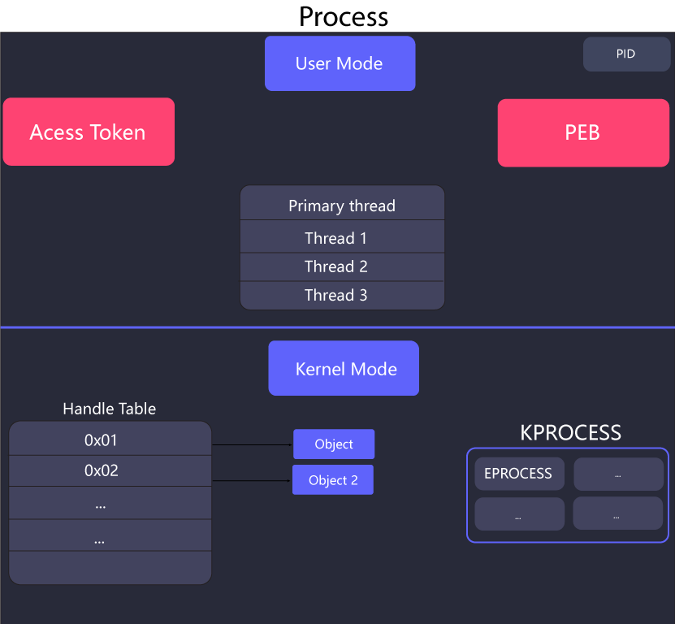
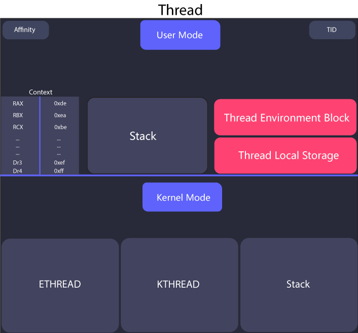
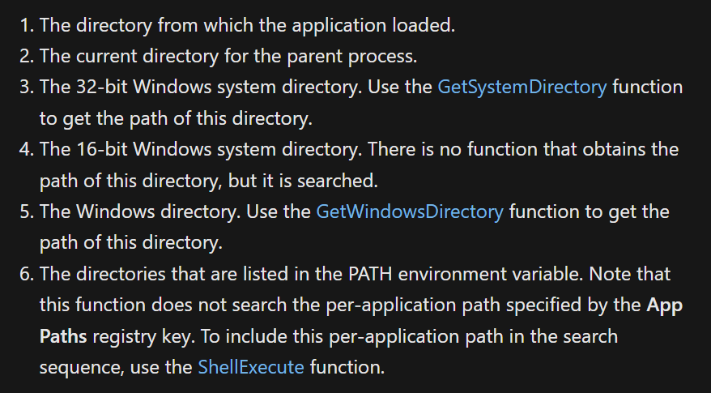
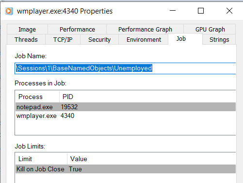

Learning how processes and threads work is a crucial part of understanding any Operating System as they are the building block on top of which almost all of the user-mode mechanisms work. Additionally, Windows offers us an elegant API that enables us to interact with them. Unsurprisingly enough, these topics can be a bit complicated to understand since Microsoft does provide a clear documentation of them and there are not a lot of resources that cover these topics clearly. Windows also provides us the fiber and job APIs which are built on top of the process and thread APIs to allow the developers to manage processes and threads "easily".  

Table of contents:

* toc
{:toc}

# Processes
Many people assume that a program and a process are the same. However, a **process** is not same as a **program**. A **program** is simply a file containing code. On the other hand, a **process** is a container of threads and various resources that are required for the threads inside the process to execute.  
A process is a kernel object.    

## Process resources
The resources that are required to run a process might differ for each process according to it's need but these are the fundamental components that every (almost) process has:    
**Process Identifier**: Process identifier (aka PID or process ID) is a unique identifier for each process on the system. While processes with same name can exist on the system, process with same process IDs can not.
    
**Private Virtual Address Space**: A specific amount of virtual addresses that a process can use. This amount is different for different systems. I've previously wrote a detailed post about Virtual Memory which can be found [here](https://de-engineer.github.io/Virtual-Address-Translation-and-structure-of-PTE/).
    
**Executable Code**: This refers to the code that is mapped into the private virtual address space ("stored in process's memory") of the process from the program. Processes can and do exist without any executable code for special purposes.    
    
**Handle Table**: A Handle table contains all the pointer to the actual objects in the kernel that are being used by the process. The handles returned by the APIs are essentially the indexes inside the handle table. This table can not be accessed from the user-mode, since it is stored in the kernel mode. Another thing to note here is that this handle table only consists of handles for kernel objects and not for any other _category_ of object, i.e. GDI and user.  
    
**Access Token**: Each process also has an access token that defines it's security context which is used by the system to check identity information such as which process belongs to which user, what are the privileges that it has, etc.  
    
**Process Environment Block**: PEB is a user-mode per process structure that contains quite a lot of information about a process, such as the arguments provided to this process, if it's being debugged or not, list of loaded modules, etc.    
This is how the PEB looks like:    
```c
struct _PEB {
    0x000 BYTE InheritedAddressSpace;
    0x001 BYTE ReadImageFileExecOptions;
    0x002 BYTE BeingDebugged;
    0x003 BYTE SpareBool;
    0x004 void* Mutant;
    0x008 void* ImageBaseAddress;
    0x00c _PEB_LDR_DATA* Ldr;
    0x010 _RTL_USER_PROCESS_PARAMETERS* ProcessParameters;
    0x014 void* SubSystemData;
    0x018 void* ProcessHeap;
    0x01c _RTL_CRITICAL_SECTION* FastPebLock;
    0x020 void* FastPebLockRoutine;
    0x024 void* FastPebUnlockRoutine;
    0x028 DWORD EnvironmentUpdateCount;
    0x02c void* KernelCallbackTable;
    0x030 DWORD SystemReserved[1];
    0x034 DWORD ExecuteOptions:2; // bit offset: 34, len=2
    0x034 DWORD SpareBits:30; // bit offset: 34, len=30
    0x038 _PEB_FREE_BLOCK* FreeList;
    0x03c DWORD TlsExpansionCounter;
    0x040 void* TlsBitmap;
    0x044 DWORD TlsBitmapBits[2];
    0x04c void* ReadOnlySharedMemoryBase;
    0x050 void* ReadOnlySharedMemoryHeap;
    0x054 void** ReadOnlyStaticServerData;
    0x058 void* AnsiCodePageData;
    0x05c void* OemCodePageData;
    0x060 void* UnicodeCaseTableData;
    0x064 DWORD NumberOfProcessors;
    0x068 DWORD NtGlobalFlag;
    0x070 _LARGE_INTEGER CriticalSectionTimeout;
    0x078 DWORD HeapSegmentReserve;
    0x07c DWORD HeapSegmentCommit;
    0x080 DWORD HeapDeCommitTotalFreeThreshold;
    0x084 DWORD HeapDeCommitFreeBlockThreshold;
    0x088 DWORD NumberOfHeaps;
    0x08c DWORD MaximumNumberOfHeaps;
    0x090 void** ProcessHeaps;
    0x094 void* GdiSharedHandleTable;
    0x098 void* ProcessStarterHelper;
    0x09c DWORD GdiDCAttributeList;
    0x0a0 void* LoaderLock;
    0x0a4 DWORD OSMajorVersion;
    0x0a8 DWORD OSMinorVersion;
    0x0ac WORD OSBuildNumber;
    0x0ae WORD OSCSDVersion;
    0x0b0 DWORD OSPlatformId;
    0x0b4 DWORD ImageSubsystem;
    0x0b8 DWORD ImageSubsystemMajorVersion;
    0x0bc DWORD ImageSubsystemMinorVersion;
    0x0c0 DWORD ImageProcessAffinityMask;
    0x0c4 DWORD GdiHandleBuffer[34];
    0x14c void (*PostProcessInitRoutine)();
    0x150 void* TlsExpansionBitmap;
    0x154 DWORD TlsExpansionBitmapBits[32];
    0x1d4 DWORD SessionId;
    0x1d8 _ULARGE_INTEGER AppCompatFlags;
    0x1e0 _ULARGE_INTEGER AppCompatFlagsUser;
    0x1e8 void* pShimData;
    0x1ec void* AppCompatInfo;
    0x1f0 _UNICODE_STRING CSDVersion;
    0x1f8 void* ActivationContextData;
    0x1fc void* ProcessAssemblyStorageMap;
    0x200 void* SystemDefaultActivationContextData;
    0x204 void* SystemAssemblyStorageMap;
    0x208 DWORD MinimumStackCommit;
);
```
**Thread**: Thread is the entity inside a process that executes code. Every process starts with at least one thread of execution, this thread is called the primary thread. A process without threads can exist, but again, it's mostly of times it's of no use since it is not running any code.    
  
**EPROCESS structure**: The `EPROCESS` (Executive Process) data structure is the kernel's representation of the process object. The structure is huge and it contains every possible bit of information related to a process, such as pointers to other data structure, values of different attributes, etc. This structure is not documented by Microsoft.    
The structure is very big in size so I'm not including it but it can be found [here](https://gist.github.com/HACKE-RC/ac54ecc7215290f649cb7bccf122795b)    
  
**KPROCESS structure**: One of the most interesting structure inside the `EPROCESS` data structure is the `KPROCESS` (Kernel Process) data structure. This data structure also contains a lot of information about the process, such as pointer to process's page directory, how much time the threads of the process has consumed in the user and kernel-mode, etc. Just like it `EPROCESS`, this structure is also not documented.    
The structure looks like this:    
```c
struct _KPROCESS {
  struct _DISPATCHER_HEADER Header;
  struct _LIST_ENTRY ProfileListHead;
  unsigned int DirectoryTableBase;
  unsigned long Asid;
  struct _LIST_ENTRY ThreadListHead;
  unsigned long ProcessLock;
  unsigned long Spare0;
  unsigned int DeepFreezeStartTime;
  struct _KAFFINITY_EX Affinity;
  struct _LIST_ENTRY ReadyListHead;
  struct _SINGLE_LIST_ENTRY SwapListEntry;
  struct _KAFFINITY_EX ActiveProcessors;
  long AutoAlignment : 1;
  long DisableBoost : 1;
  long DisableQuantum : 1;
  unsigned long DeepFreeze : 1;
  unsigned long TimerVirtualization : 1;
  unsigned long CheckStackExtents : 1;
  unsigned long SpareFlags0 : 2;
  unsigned long ActiveGroupsMask : 20;
  long ReservedFlags : 4;
  long ProcessFlags;
  char BasePriority;
  char QuantumReset;
  unsigned int Visited;
  union _KEXECUTE_OPTIONS Flags;
  unsigned long ThreadSeed[20];
  unsigned int IdealNode[20];
  unsigned int IdealGlobalNode;
  union _KSTACK_COUNT StackCount;
  struct _LIST_ENTRY ProcessListEntry;
  unsigned int CycleTime;
  unsigned int ContextSwitches;
  struct _KSCHEDULING_GROUP *SchedulingGroup;
  unsigned long FreezeCount;
  unsigned long KernelTime;
  unsigned long UserTime;
  void *InstrumentationCallback;
};
```

This diagram shows the components of a process:    
  
{: .align-center}

# Threads
Threads are the actual entities inside a process that are running code on the CPU. Threads can execute any part of the code. A process provides all the resources that threads require to complete their task. Without threads, a process can't run any code. A process can have multiple threads and such processes are called multi-threaded processes.  

## Thread scheduling
When there are multiple threads on the system, the scheduler switches between different threads and creates an illusion that all the threads running in parallel. While what's really happening is that the scheduler is switching between different threads so quickly that it appears that the threads are running in parallel.  
The amount of time for which a thread can run on a CPU before it switches is called the thread's quantum. This quantum is a value that is set by the scheduler. This is usually set to a value that is a multiple of the processor's clock speed.  
Windows uses priority based thread scheduling model where the scheduler uses the thread's priority to determine which thread should run next. The priority of a thread is a value that is set by the thread's creator or by the system.  
Because this system is quite complex, I will not go over it in detail here.  

## Thread resources
While a process provides a fair amount of resources for threads to run, there are still a few things that threads need in order to execute, these include:    
    
**Context**: Every thread has a context which is a user-mode per thread data structure (managed by kernel) that contains the state of all the registers from the time the thread was last executed on the CPU. This data structure is very important because there can't be multiple threads running on a CPU, so Windows switches between different threads after a few moments and each time it switches a thread, it stores the current CPU registers' state in the context. This context is loaded again into as the values of the registers when the thread resumes it's execution on the CPU. Since this data structure stores information related to registers, it's processor-specific.    
This is the how the data structure looks like for x64 machines:    
```c
typedef struct _CONTEXT {
  DWORD64 P1Home;
  DWORD64 P2Home;
  DWORD64 P3Home;
  DWORD64 P4Home;
  DWORD64 P5Home;
  DWORD64 P6Home;
  DWORD   ContextFlags;
  DWORD   MxCsr;
  WORD    SegCs;
  WORD    SegDs;
  WORD    SegEs;
  WORD    SegFs;
  WORD    SegGs;
  WORD    SegSs;
  DWORD   EFlags;
  DWORD64 Dr0;
  DWORD64 Dr1;
  DWORD64 Dr2;
  DWORD64 Dr3;
  DWORD64 Dr6;
  DWORD64 Dr7;
  DWORD64 Rax;
  DWORD64 Rcx;
  DWORD64 Rdx;
  DWORD64 Rbx;
  DWORD64 Rsp;
  DWORD64 Rbp;
  DWORD64 Rsi;
  DWORD64 Rdi;
  DWORD64 R8;
  DWORD64 R9;
  DWORD64 R10;
  DWORD64 R11;
  DWORD64 R12;
  DWORD64 R13;
  DWORD64 R14;
  DWORD64 R15;
  DWORD64 Rip;
  union {
    XMM_SAVE_AREA32 FltSave;
    NEON128         Q[16];
    ULONGLONG       D[32];
    struct {
      M128A Header[2];
      M128A Legacy[8];
      M128A Xmm0;
      M128A Xmm1;
      M128A Xmm2;
      M128A Xmm3;
      M128A Xmm4;
      M128A Xmm5;
      M128A Xmm6;
      M128A Xmm7;
      M128A Xmm8;
      M128A Xmm9;
      M128A Xmm10;
      M128A Xmm11;
      M128A Xmm12;
      M128A Xmm13;
      M128A Xmm14;
      M128A Xmm15;
    } DUMMYSTRUCTNAME;
    DWORD           S[32];
  } DUMMYUNIONNAME;
  M128A   VectorRegister[26];
  DWORD64 VectorControl;
  DWORD64 DebugControl;
  DWORD64 LastBranchToRip;
  DWORD64 LastBranchFromRip;
  DWORD64 LastExceptionToRip;
  DWORD64 LastExceptionFromRip;
} CONTEXT, *PCONTEXT;
```
    
  
**Two stacks**: Every thread has two stacks, a user-mode stack and a kernel-mode stack. The user-mode stack is used for normal purposes, such as for storing the values of variables. Unsurprisingly, the kernel stack is not accessible from the user-mode and it's used as security mechanism.    
When a threads calls a syscall, all of the arguments provided to that syscall are copied from the thread's user-mode stack to it's kernel-mode stack. It is done this way because after a thread uses a syscall, the CPU switches to the kernel mode and then the kernel-mode code validates those arguments to see if all the pointers, structures, etc that are passed are valid or not and since this stack is not accessible from the user-mode, a thread can not manipulate the arguments after they have been validated and this way, having two stacks works as a strong security measure.    

**Thread Local Storage**: The thread local storage is a data structure that is used to store data that is specific to each thread. This data is stored in the thread's context and is not shared between threads.    
    
**Thread ID**: Just like every process has a unique identifier, every thread also has a unique identifier called a thread ID (TID).    
    
**Thread Environment Block**: Like processes, threads also have most of their information stored in a data structure called the Thread Environment Block (TEB). This structure contains information such as pointer to the TLS, the `LastErrorValue` (this has to be this way because if two threads called `GetLastError` and one thread gets the `LastErrorValue` of some other thread then it can lead to total chaos), pointer to PEB, etc. TEB is also not documented by Microsoft.    
This structure can be found [here](https://gist.github.com/HACKE-RC/687fdae74f80a83f32e24a9b593106a8)

**Affinity**: Setting affinity for a thread forces Windows to run a thread only on a specific CPU. For example, let's say your machine has for CPU and you set the affinity of process `linux.exe` to CPU 3 then that thread will only run on CPU 3 until it finishes execution or it's affinity is changed.   

**ETHREAD structure**: The `ETHREAD` structure (Executive Thread) is the kernel representation of the thread object. Similar to `EPROCESS`, this structure also contains every possible bit of information about a thread, such as a pointer to the PEB, LastErrorValue, if this thread is the initial thread (main thread) of the process or not, etc. This structure is also not documented by Microsoft.    
This structure can be found [here](https://gist.github.com/HACKE-RC/25cceb6d5eded8c447381f2b9eda0068)  

**KTHREAD structure**: The `KTHREAD` data structure (Kernel Thread) is also one of the important data structure inside `ETHREAD` data structure. It includes information such as the pointer to the kernel stack, a lot of information about it's scheduling (when and for how long this thread will run on the CPU), pointer to TEB, how much time the thread has spent in the user-mode, etc. This structure is also not documented by Microsoft.    
This structure can be found [here](https://gist.github.com/HACKE-RC/7d5f031abf50cc9cfcbeb8dc0a5f3619)  
    
This diagram shows the components of a process:    
  
{: .align-center}

## Using Threads
Using threads is very simple. We just need to create a thread using the `CreateThread` function. The thread will start executing at the address of the specified function.  
The function that we want to run in the thread is called the thread's entry point. The entry point is the function that is called when the thread is created.  
  
Here's the signature of the `CreateThread` function:  
  
```c
HANDLE CreateThread(
  [in, optional]  LPSECURITY_ATTRIBUTES   lpThreadAttributes,
  [in]            SIZE_T                  dwStackSize,
  [in]            LPTHREAD_START_ROUTINE  lpStartAddress,
  [in, optional]  __drv_aliasesMem LPVOID lpParameter,
  [in]            DWORD                   dwCreationFlags,
  [out, optional] LPDWORD                 lpThreadId
);
```  
The first parameter is the security attributes. This is a pointer to a `SECURITY_ATTRIBUTES` structure that contains information about the security of the thread. This is optional and can be `NULL` for default security.  
The second parameter is the stack size. This is the size of the stack that the thread will use. This is optional and can be `0` for default stack size.  
The third parameter is the address of the function that will be executed in the thread. This is the entry point of the thread.  
The fourth parameter is the parameter that will be passed to the thread. This is optional and can be `NULL` for no parameter.  
The fifth parameter is the creation flags. This is a set of flags that determines how the thread will be created. This is optional and can be `0` if we want the thread to directly execute after being created.  
The sixth parameter is the thread ID. This is a pointer to a variable that will receive thread ID after it's created. This is optional and can be `NULL` if we do not want to store the thread's ID.  

## Fibers
Fibers are unit of execution that allow us to manually schedule (define our own scheduling algorithm) them rather than being automatically scheduled by the scheduler. Fibers run in the context of the threads that created them. Every thread can have multiple fibers and a thread can run one fiber at a time (we decide which). Fibers are often called lightweight threads.  
Fibers are invisible to the kernel as they are implemented in the user-mode in Kernel32.dll.  

### Using Fibers
The first step when using fiber is to convert our own thread into a fiber. This is done by calling the `ConvertThreadToFiber` function. This is the signature for the function:  
```c
LPVOID ConvertThreadToFiber(
  [in, optional] LPVOID lpParameter
);
```

This function returns the memory address of the fiber's context that was created. This address is useful later when performing operations on the fiber. The fiber's context is similar to than that of a thread but it has a few more elements than just registers, these include:  
- The value of `lpParameter` that was passed to `ConvertThreadToFiber`.
- The top and bottom memory addresses of the fiber's stack.  
and more.

After this function is called our thread gets converted into a fiber and it starts running on our thread. This fiber may exit either when it's done executing or when it calls `ExitThread` (in this case, the thread and fiber both get terminated).  

Now, to create a fiber, we need to call the `CreateFiber` function. This is the signature for the function:  
```c
LPVOID CreateFiber(
  [in]           SIZE_T                dwStackSize,
  [in]           LPFIBER_START_ROUTINE lpStartAddress,
  [in, optional] LPVOID                lpParameter
);
```

The first argument is used to specify the size of the fiber's stack, generally, 0 is specified, which uses the default value and creates a stack that can scale grow up to 1 MB. The second argument is the address of the function that will be executed when the fiber is scheduled. The third argument is the parameter that will be passed to the function that will be executed.  
This function also returns the memory address of the fiber's context that was created with this context having one additional element: the address of the function that will be executed.  
Remember that calling this function only creates the fiber and doesn't start it. To start the fiber, we need to call the `SwitchToFiber` function. This is the signature for the function:  
```c  
void SwitchToFiber(
  [in] LPVOID lpFiber
);
```
This function takes only one argument, the address of the fiber's context that was previously returned by `CreateFiber`. This function actuall starts the execution of the fiber.  
  
To destroy a fiber, we need to call the `DeleteFiber` function. This is the signature for the function:  
```c
void DeleteFiber(
  [in] LPVOID lpFiber
);
```
It only takes one argument, the address of the fiber's context that we want to delete.  


# CreateProcess internals
Usually, when a thread wants to create another process, it calls the Windows API function `CreateProcess` and specifies the parameters accordingly to create a process with required attributes. This function is takes a lot of arguments and is quite flexible and can be used in almost all cases.  
However, sometimes the capabilities of this functions are not enough so other functions (sometimes just a wrapper of this function) are used, here are some of them:  

- `CreateProcessAsUser` allows you to create a process on the behalf another user by allowing you to specify the handle to that user's primary token.
- `CreateProcessWithTokenW` gives you the same capabilities as the previous function but this one just requires a few different privileges.
- `CreateProcessWithLogonW` allows you to provide the credentials of the user in whose context you want to create a process.
- `ShellExecute` is a very unique function. All the previous functions that we talked about work with any valid Portable Executable (PE) file and they do not care about the file extension of the file that you specified, i.e, you can rename the original `notepad.exe` to `notepad.txt` and give it to any of those functions and they would still create a process from it.  
However, the `ShellExecute` and `ShellExecuteEx` are a bit different. These functions accept any file format and then they look inside the `HKLM\SOFTWARE\Classes` and `HKCU\SOFTWARE\Classes` registry keys to find the program which is associated with the file format of the file you gave it as an argument and then they eventually call the `CreateProcess` function with the appropriate executable name/path along with the file name appended, for example you can provide this function a txt file and it will launch notepad with the filename as an argument (`notepad.exe filename.txt`).

`CreateProcess` and `CreateProcessAsUser` both are exported by `Kernel32.dll` and both of them eventually call `CreateProcessInternal` (also exported by `Kernel32.dll`) which also ends up calling the `NtCreateUserProcess` function which is exported by `ntdll.dll`. `NtCreateUserProcess` is the last part of the user-mode code of all user-mode process creation functions, after this function is done with it's work, it makes a syscall and transforms into kernel mode. Both `CreateProcessInternal` and `NtCreateUserProcess` are officially undocumented by Microsoft at the time of writing this post.  
However, the `CreateProcessWithTokenW` and `CreateProcessWithLogonW` functions are exported by `Advapi32.dll`. Both of these functions make a Remote Procedure Call (RPC) to the Secondary Login Service (`seclogon.dll` hosted in `svchost.exe`), this service allows processes to be started with different user's credentials and then Secondary Logon Service executes this call in its `SlrCreateProcessWithLogon` function which eventually calls `CreateProcessAsUser`.  

## Arguments
The arguments for all the `CreateProcess*` functions are almost completely similar with a only a few differences. The explanation of all the `CreateProcess*` functions would be tedious to write as well as very boring to read, so here is the brief overview of the description of different arguments:  

- The first argument for `CreateProcessAsUser` and `CreateProcessWithTokenW` are the handle to the token under which the process will be started. However, in the case of `CreateProcessWithLogonW`, the first arguments include the username, domain and password of the user on whose behalf the process will be started.  
- The next _important_ argument `lpApplicationName`, which is the full path to the executable to run. This argument can be left `NULL` and instead the next argument can be used.  
- The next argument after `lpApplicationName` is `lpCommandLine`. This argument doesn't require us to put the provide the full path of the executable we want create a process of (we can provide it full path but it's optional), the reason behind this is that when we provide it an executable's name without a path in this argument, the function searches through several pre-defined paths in an order to find that file's path. This is the order defined in msdn:  
  

- The next _important_ arguments are `lpProcessAttributes` and `lpThreadAttributes`. Both of them take a pointer to `SECURITY_ATTRIBUTES` structure and both of them can be `NULL`, and when this argument is specified `NULL` then the default security attributes are used. we can specify whether we want to make the handle of the process that is about to be created (in `lpProcessAttributes`) and it's primary thread (in `lpProcessAttributes`) inheritable by all the other child processes that the caller of `CreateProcess*` creates or not in the `bInheritHandle` member of `SECURITY_ATTRIBUTES`.
- The next _important_ argument is `bInheritHandles`. This argument specifies whether we want the process that is about to be created to inherit all the inheritable handles from the handle table of the parent process or not.
- The next _important_ argument is `dwCreationFlags`. This argument allow us to specify different flags that affect the creation of the process, such as:
  - `CREATE_SUSPENDED`: The initial thread of the process being created is started in suspended state (paused state, it doesn't directly run after it's created). A call to `ResumeThread` can be used thereafter to resume the execution of the thread.
  - `DEBUG_PROCESS`: The calling process declares itself as a debugger and creates the process under it's control.
- The next argument is `lpEnvironment`. This argument is optional and is used to provide a pointer to the an environment variables' block. Since it's optional, we can specify it `NULL` and it will inherit it's environment variables from it's parent process.
- The next argument is `lpCurrentDirectory`. This argument is also optional and is used if we want the process about to be created will have a different current directory than the parent process. If left `NULL`, the new process will use the current directory of the parent process.  
- The next argument is `lpStartupInfo`. This argument is used to specify a pointer to `STARTUPINFO` or `STARTUPINFOEX` structures. The `STARTUPINFO` structure contains some more configuration related for the new process. `STARTUPINFOEX` structure has an extra field which is used to specify some more attributes for the new process.
- The last argument is `lpProcessInformation`. This argument is used to specify a pointer to `PROCESS_INFORMATION` structure. The `CreateProcess*` functions returned the information of the new process in this structure, this information includes the process id of the new process, the thread id of the primary thread, a handle to the new process, etc.  


# Classification of Processes
Windows provides some (almost) completely different attributes for processes that require extra security or have a special purpose. These processes are not launched like normal processes and they also have different attributes.

## Protected Processes
The concept of protected processes was initially introduced to imply with Digital Rights Management (DRM) requirements which were imposed by the media industry for protection of content such as HD-DVD media.  
Normally, threads of any process which as debug privilege (usually processes started by the administrator account) could read or write data and code into the memory of any process running on the system. This behavior is very useful in a lot of cases. However, this behavior violates the DRM requirements and for this reason, Windows uses protected processes.  
These process exist with normal Windows process, but they provide with little to no access to other processes on the system (even the one's running with administrator privileges).  
These processes can be created by any application on the system with whatever rights they have, but for an executable to be able to run as a protected process, it must be signed with a special Windows Media Certificate. This certificate is a digital signature that is used to identify the executable as a protected process.  
These process also only load DLLs that are signed with a special certificate and the data of these processes are only accessible to either kernel or other protected processes.  
Examples of protected process are:  
- The Audio Graph Device process (Audiodg.exe) that is used by Windows to decode protected DRM audio content.
- The Media Foundation Protected Media Path (Mfpmp.exe) process used by Windows to decode DRM video content.
- The Windows Error Reporting (WER, Werfaultsecure.exe) for reporting crashes of protected apps. This the protected version of WER is required because the normal WER process executes as a normal process and therefore it can't access the data inside the crashed protected processes.
- The system process.


### Protected Processes Light (PPL)
PPL is the extended version of Protected Processes introduced allow third party processes, such as Antivirus programs to have same privileges as protected processes. However, PPLs comes with a slight difference, i.e., how much protected a PPL will be depends upon it's signature, which results in some PPLs having more or less protection than others.  
Most system processes on Windows are PPL protected, such as `smss.exe`, `csrss.exe`, `services.exe`, etc.  

## Minimal Processes
These are essentially empty processes. These processes have empty user-mode address space, ntdll.dll or other subsystem DLLs are not loaded, no PEB or TEB or any related structure are created, no initial thread is created and no executable image is mapped. There processes are created and managed by the kernel and the kernel provides no way to create such processes from the user-mode since these are not meant to be used by the user, but rather by the system to perform special tasks.  
These process can have threads and these threads are called minimal threads. These threads don't have any Thread Environment Block (TEB) or stack.  

An example of this is the memory compression process which stores compressed memory of active processes, this process is used to keep more processes memory without paging them out to the disk (this process is hidden from task manager because since it stores compressed memory, it has a lot of memory usage and average users used to get suspicious about this process). You can view this process in process explorer, if you just sort the processes by their working set (amount of physical memory currently being used), this process should appear on top (it might not, if you have some program eating so much of your ram). This process also has no threads or code.    
  

## Pico Processes
Windows introduced the concept of pico processes based on their research called the Project Drawbridge. These are minimal processes with a supporting driver called the pico provider. This driver can manage almost everything related to the execution of the pico process it's managing and this property of pico providers allow them it can act like a separate kernel for that process without the process having any sense of the original system it's running on, however, the management of memory, I/O and thread scheduling is still done by the original Windows kernel.  
A pico provider is able to intercept all the operations that of the pico process that require any handling by the kernel, this includes things such as system calls, exceptions, etc and respond accordingly.  
Pico processes can have pico threads (minimal threads for pico processes) and also normal threads. The pico threads also have a context which is stored in the `PicoContext` member of `ETHREAD` structure.  

###  Windows Subsystem for Linux
The Windows Subsystem for Linux (WSL) is built on this idea of pico processes. WSL is able to run whole linux system nearly perfectly on Windows without having a single line of code from the linux kernel. This is made possible by the incredible control that pico providers allow.    
The pico providers for WSL are `lxss.sys` and `lxcore.sys`. These drivers emulate the behavior of the linux kernel by converting all the linux syscalls made from the WSL pico process to NT APIs or by calling specific components that are implemented from scratch.  
This implementation of WSL on Windows is a very interesting topic and complicated topic, I might cover it later in some other blog post!  
  
## Trustlets (Secure Processes)
Trustlets are another type of processes that provide strong security. Trustlets can not be directly created by the user. They are created by the Windows kernel when a user-mode application requests to create a secure process.  
Trustlets use Virtual Trust Levels provided by Hyper-V Hypervisor to isolate themselves in the system. These levels are used to provide the security of the trustlet. The trustlet can only import DLLs that are signed with a certificate that is trusted by the system and other system trusted DLLs such as C/C++ runtime libraries, Kernelbase, Advapi, RPC runtime, CNG base Crypto, and other mathematical libraries that do no require any syscall to work.  
The way truslets work is a bit complex as it requires the understanding of how Hypervisors work so I am not covering that here. However, you can read more about them [here](https://docs.microsoft.com/en-us/windows/win32/procthread/isolated-user-mode--ium--processes) on msdn.    

# Jobs
Jobs are a Windows mechanism to group and manage processes together and have them share the same security context. This can be used to run a bunch of processes that are related to each other, for example if you want to manage multiple processes that are the part of same application.  
Jobs are shareable, securable and nameable. Any change to the job will affect all the processes in the job. Jobs are used to impose limits on a set of processes, for example if you want to limit the number of processes of an application that can be running at the same time.  
Once a process is assigned to a job, it can not leave that job. Child processes created by the processes inside a job will also be a part of that job unless `CREATE_BREAKAWAY_FROM_JOB` was specified to `CreateProcess` and the job itself allows processes to break out from it (a job can deny processes inside it from breaking out of it).  
  

## Job limits
Here are few of the limits that we can set in a job:  
- **Max active processes**: This is used to limit the amount of processes that can exist in a job. When this limit is reached, no new processes are allowed to assign to that job and creation of child processes is blocked.  
- **Processor Affinity**: This is used to limit all the processes inside a job to only on a specific CPU.  
- **Priority Class**: This is used to set the priority class for all the members of a job. If the thread of any process that is the member of a job that has it's priority class set tries to increase it's priority class, it's request will be ignored and no error will be returned (to `SetThreadPriority`).  
- **Virtual Memory Limit**: This is used to restrict the maximum amount of virtual memory that can be committed by single processes or the entire job.  
- **Clipboard R/W**: This is used to disallow all the members of a job from accessing or writing to the clipboard.  

## API functions for working with Jobs
The Windows API provides us all the important functions that are required to manage and work with job objects. Here are few of the important functions:  

- **CreateJobObject**: Used to create a job object. It can also be used to open a job object.  
- **OpenJobObject**: Used to open an already existing job object.  
- **AssignProcessToJobObject**: Used to assign a process to a job object.
- **SetInformationJobObject**: Used to set limits for the processes inside a job object.  
- **QueryInformationJobObject**: Used to retrieve information about the a job object.
- **TerminateJobObject**: Used to terminate all the processes inside a job object.
- **IsProcessInJob**: Used to check if a process is a member of a job object.

## Using Jobs
Working with jobs is also quite simple. You can create a job object, assign processes to it and set limits on the processes inside the job. You can also use the API functions to query and set the limits on the processes inside the job.  
To create a job object, you can use the `CreateJobObject` function. This function returns a handle to the job object. Here is the function signature:  

```c
HANDLE CreateJobObjectA(
  [in, optional] LPSECURITY_ATTRIBUTES lpJobAttributes,
  [in, optional] LPCSTR                lpName
);
```  

The `lpJobAttributes` parameter is a pointer to a `SECURITY_ATTRIBUTES` structure that can be used to set the security attributes for the job object. It can be `NULL` if you want the job object to have default security attributes.  
The `lpName` parameter is a pointer to a string that can be used to name the job object. This parameter can also be `NULL` which will result in the job object being unnamed. If the name matches the name of an existing mutex, file-mapping object or waitable object, the function will fail.  

After creating an empty job object, you can assign processes to it. To do this, you can use the `AssignProcessToJobObject` function. Here is the function signature:  

```c
BOOL AssignProcessToJobObject(
  [in] HANDLE hJob,
  [in] HANDLE hProcess
);
```

The `hJob` parameter is a handle to the job object.  
The `hProcess` parameter is a handle to the process that you want to assign to the job object.  
To get the handle of the current process, you can use the `GetCurrentProcess` function.  
  
To set the limits on the processes inside the job, you can use the `SetInformationJobObject` function. Here is the function signature:  

```c
BOOL SetInformationJobObject(
  [in] HANDLE             hJob,
  [in] JOBOBJECTINFOCLASS JobObjectInformationClass,
  [in] LPVOID             lpJobObjectInformation,
  [in] DWORD              cbJobObjectInformationLength
);
```
The `hJob` parameter is a handle to the job object.  
The `JobObjectInformationClass` parameter is a value that specifies the type of information that you want to set. The next parameter is used to specify the actual information that you want to set.  
The `lpJobObjectInformation` parameter is a pointer to the structure containing information that you want to set.  

# Code Examples
Now that you know the basics of working with processes, jobs, threads and fibers let's see some code examples.  
  
## Creating a Process
Let's start by looking at how to create a process.  
  
```c
#include <stdio.h>
#include <windows.h>

int main(){
    STARTUPINFOA si;
    PROCESS_INFORMATION pi;

    ZeroMemory( &si, sizeof(si) );
    si.cb = sizeof(si);
    ZeroMemory( &pi, sizeof(pi) );
    LPSTR lpCommandLine = "notepad.exe";

    // Start the child process. 
    if( !CreateProcessA( NULL,   // No module name (use command line)
        lpCommandLine,        // Command line
        0,           // Process handle not inheritable
        0,           // Thread handle not inheritable
        0,          // Set handle inheritance to FALSE
        0,              // No creation flags
        0,           // Use parent's environment block
        0,           // Use parent's starting directory 
        &si,            // Pointer to STARTUPINFO structure
        &pi )           // Pointer to PROCESS_INFORMATION structure
    ){
        printf( "CreateProcess failed (%d).\n", GetLastError() );
        return -1;
    }
    printf("Process Created!\n");

    // Sleep for 5 seconds
    Sleep(5000);

    // Close process and thread handles. 
    CloseHandle( pi.hProcess );
    CloseHandle( pi.hThread );

    return 0;
}
```
This code should open notepad.exe and exit after 5 seconds.  
Process creation is pretty easy, you just need to know the name of the executable and the command line arguments if you want to pass any.  

## Creating a Thread
Now that you know how to create a process, let's look at how to create a thread.  
  
```c
#include <stdio.h>
#include <windows.h>

// Function to create a thread
int EthicalFunction(LPVOID lpParam)
{
    // Print a message
    printf("Thread created\n");
    printf("For educational purposes only*\n");
    // Return success
    return 0;
}

int main()
{
    // Create a thread
    HANDLE hThread = CreateThread(NULL, 0, (LPTHREAD_START_ROUTINE)EthicalFunction, NULL, 0, NULL);
    // Wait for thread to finish
    WaitForSingleObject(hThread, INFINITE);
    printf("Thread returned\n");
    printf("Exiting...\n");
    // Close thread handle
    CloseHandle(hThread);
    // Return success
    return 0;
}
```

This code is creating a thread for the `EthicalFunction` function and waiting for it to finish and then exiting after printing a message.  
You can create multiple threads for multiple functions like this, for example if you want to create a thread a background thread that runs in the background and does not block the main thread until it is finished with its work.  

## Creating a Fiber
Next, let's look at how to create a fiber.  
  
```c
#include <stdio.h>
#include <windows.h>

// fiber function
void fiber_function(void* lpParam)
{
    // Print a message
    printf("Fiber created\n");
    printf("For educational purposes only*\n");
    // Converting back into the main thread as fiber will not return to the main thread by itself
    SwitchToFiber(lpParam);

}

// main function
int main()
{
    // Converting thread to fiber
    LPVOID Context = ConvertThreadToFiber(NULL);
    // Creating fiber
    LPVOID lpFiber = CreateFiber(0, (LPFIBER_START_ROUTINE)fiber_function, Context);
    // Switching to fiber (executing fiber function)
    SwitchToFiber(lpFiber);
    // Printing a message
    printf("Fiber returned\n");
    // Deleting fiber
    DeleteFiber(lpFiber);
    // Return success
    printf("Exiting...\n");
    return 0;
}
```

This code will create a fiber and execute it and then switch back to the main thread and the main thread will print a message and delete the fiber.  

## Creating a Job Object
Let's look at how to create a job object and assign a processes to it.  
  
```c
#include <stdio.h>
#include <windows.h>

int main()
{
    // Creating a job with default security attributes
    HANDLE hJob = CreateJobObject(NULL, "Unemployed");
    // Setting the job to terminate when all processes in it terminate
    JOBOBJECT_EXTENDED_LIMIT_INFORMATION jeli = {0};
    jeli.BasicLimitInformation.LimitFlags = JOB_OBJECT_LIMIT_KILL_ON_JOB_CLOSE;
    SetInformationJobObject(hJob, JobObjectExtendedLimitInformation, &jeli, sizeof(jeli));
    // Creating structures for notepad, cmd and powershell
    STARTUPINFOA si = {0};
    si.cb = sizeof(si);
    PROCESS_INFORMATION pi = {0};
    STARTUPINFOA si1 = {0};
    si1.cb = sizeof(si1);
    PROCESS_INFORMATION pi1 = {0};

    // Creating notepad, and Windows media player in suspended state and adding them to the job and checking for errors
    if (!CreateProcessA(NULL, (LPSTR)"notepad.exe", NULL, NULL, FALSE, CREATE_SUSPENDED, NULL, NULL, &si, &pi) || !CreateProcessA(NULL, (LPSTR)"dvdplay.exe", NULL, NULL, FALSE, CREATE_SUSPENDED, NULL, NULL, &si1, &pi1))
    {
        printf("Error creating processes\n");
        printf("Error code: %d\n", GetLastError());
        return 1;
    }
    
    AssignProcessToJobObject(hJob, pi.hProcess);
    AssignProcessToJobObject(hJob, pi1.hProcess);

    // Resuming processes
    ResumeThread(pi.hThread);
    ResumeThread(pi1.hThread);
    printf("Job created and processes added!\n");
    
    // SLeeping for 1 minutes to let the processes run
    Sleep(60000);
    // Terminating the job
    TerminateJobObject(hJob, 0);
    // Closing handles
    CloseHandle(pi.hProcess);
    CloseHandle(pi.hThread);
    CloseHandle(hJob);

    // Return success
    printf("Exiting...\n");
    return 0;
}
```

This code will create a job object named `Unemployed` and add two notepad and Windows Media Player processes to it and then terminate the job after 1 minutes.  
To confirm that the processes are running inside the `Unemployed` job, you can use Process Explorer to view the Properties -> Job of either `notepad.exe` or `wmplayer.exe` (not `dvdplay.exe` as it immediately launches this as the child process, it can also be `setup_wm.exe` if you do not have your Windows Media Player setup).  
Here's an example image:  


# Summary
This post covered an overview of the internals of processes, threads, fibers and jobs as well the classification of processes into different types. We also looked at the different components of a process. Later, we looked at how to create a process, thread, fiber and job objects.  
I hope you enjoyed this post and found it useful.  
Thank you for reading!

# Resources
- [Process and Threads - msdn](https://docs.microsoft.com/en-us/windows/win32/procthread/processes-and-threads)
- [CreateProcess - msdn](https://docs.microsoft.com/en-us/windows/win32/api/processthreadsapi/nf-processthreadsapi-createprocessa)
- [CreateJobObject - msdn](https://docs.microsoft.com/en-us/windows/win32/api/winbase/nf-winbase-createjobobjecta)
- [AssignProcessToJobObject - msdn](https://docs.microsoft.com/en-us/windows/win32/api/jobapi2/nf-jobapi2-assignprocesstojobobject)
- [AssignProcessToJobObject fails with "Access Denied" error when running under the debugger](https://stackoverflow.com/questions/89588/assignprocesstojobobject-fails-with-access-denied-error-when-running-under-the)
- [TerminateJobObject - msdn](https://docs.microsoft.com/en-us/windows/win32/api/winbase/nf-winbase-terminatejobobject)
- [CreateThread - msdn](https://docs.microsoft.com/en-us/windows/win32/api/processthreadsapi/nf-processthreadsapi-createthread)
- [CreateFiber - msdn](https://docs.microsoft.com/en-us/windows/win32/api/winbase/nf-winbase-createfiber)
- [SwitchToFiber - msdn](https://docs.microsoft.com/en-us/windows/win32/api/winbase/nf-winbase-switchtofiber)