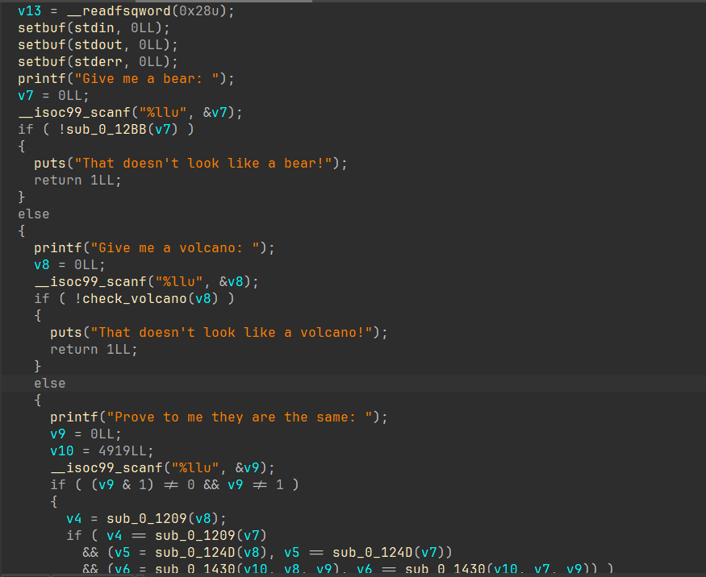
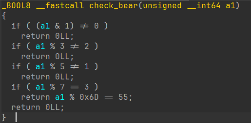
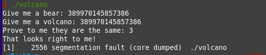

Satisfiability Modulo Theories (SMT) solvers are one of the most interesting topics to learn about in Computer Science. They can reduce a big chunk of time that would otherwise be spent on statically or dynamically analyzing the binary.
While SMT solvers have their limits, when they work, they work like magic. You might already have heard of or seen someone use a SMT solver like Z3 for solving CTF challenges or Program Analysis. By the end of this blog, you'll have a good grasp of all the required knowledge to get started with SMT solvers and use Z3.

This post does not use any complicated mathematics to explain these solvers and will deal with only required theory and examples to get started. To go deep into SMT solvers and Program Analysis check out #resources.

**Info: If you want to watch a video version (covers 50% of this blog): [Watch Here](https://www.youtube.com/watch?v=EacYNe7moSs)**
{: .notice--info}


Table of contents:
* toc
{:toc}

# SAT Solvers
SMT solvers leverage the powers of another type of solvers called Boolean Satisfiability Problem solvers (SAT solvers). As the name suggests, they have something to do with Boolean variables. 

These solvers basically take a Boolean expressions as input and output whether there are possible values for the Boolean variables which result in the expression returning `true` (or `satisfiable`). When there are no such variables SAT solver outputs `false` (or `unsatisifable`). 
If the expression is satisfiable then the SAT solver can also output the values for the variables which satisfy the expression.

## Relation with SMT solvers
Satisfiability Modulo Theory (SMT) solvers essentially combine the powers of SAT solvers and some other type of solvers but SAT solvers are the primary backend of SMT solvers.
SMT solvers like SAT are able to find not only the satisfiability but also the satisfying inputs for Boolean expressions but they are not limited to just Boolean expressions. SMT solvers are capable of other inputs such as integer, bitvector, arrays and arithmetic operations. 

### Terminologies
There are few terms that you'll need to know when navigating through the smt solver territory.
**Concrete values**: Concrete values are simply constant values. For example `5` is a concrete value. It's that simple.
**Symbolic values**: Symbolic values are like the unknown variables which you have when dealing with an algebraic expression. These are have are used to represent values which are not yet known. 
Example: `3x + 2y = 1`, in this expression `x` and `y` are symbolic values.

# Symbolic Execution
Symbolic Execution is a technique which essentially reduces the conditions inside given program into mathematical equations and tries to solve them using SMT and SAT solvers. 

Instead of just theoretical explanation, let us look at an example in order to understand the the essence of Symbolic Execution.
Consider the following C program:
```c
int main() {
  int j = getUserInput();
  int k = j * 2;

  if (k > 0) {
    if (k * 2 == 8) {
      printf("Correct input!\n");
    } else {
      exit(-1);
    }
  } else {
    exit(-1)
  }
}
```
When compiled and executed normally, this program would take an concrete integer input (_lets say 7_) from the user and evaluate and run into the path which is satisfiable which would result in the program calling the exit function in this case.
However, when run with symbolic execution:
- `j` will be assigned a symbolic value (_e.g. `γ`_)
- k will be assigned `γ * 2`
- At the if statement, the symbolic execution engine will remember the condition as a constraint (_i.e. `γ * 2 > 0`_) and execute the if branch and at the same time remember the else branch and add it's constraint (_`γ * 2 < 0`_) and execute that too symbolically with a copy of the program's current state just like what the if branch has except with a different constraint.
	- The path that the if branch takes has another if condition whose constraint (_`γ * 2 * 2 == 8`_) is again remembered along with the existing constraint (_`γ * 2 > 0`_) and also symbolically executes the else branch at the same time with the opposite constraints.
		- The if branch then proceeds and executes the code which essentially leads the program to exit normally after printing "Correct Input!", the symbolic execution engine then solves the remembered constraints [` * 2 > 0`, `γ * 2 * == 8`] which results in a concrete value and remembers the paths it leads to.
	- The path that the else branch takes simply exits so the concrete value to this path is solved and remembered. 
- The path that the else branch takes leads to an exit after which the symbolic execution engine solves the constraints and get's the concrete value which will satisfy the constraints (_i.e. γ * 2 < 0_) and remembers the path it leads to. 
After the execution is complete, the symbolic execution engine will output all the possible inputs or the requested inputs and tell where they will lead.

Let us first label all the code paths so it will be easier for us to understand:
```c
int main() {
  int j = getUserInput();
  int k = j * 2;

  if (k > 0) {
    path_if_1:
    if (k * 2 == 8) {
      path_if_2:
      printf("Correct input!\n");
    }
    else {
      path_else_2:
      exit(-1);
    }
  }
  else {
    path_else_1:
    exit(-1)
  }
}
```
Here's what we assume the Symbolic Execution engine will tell us:


|---
| Constraint | Path | Solution
|-|:-|:-:|-:
| k > 0 | path_if_1 | All numbers greater than 0 (n > 0) 
| k < 0 | path_else_1 | All numbers are smaller than 0 (n < 0)
| [k > 0, k * 2 == 8] | path_if_2 | 2 (n=2)
| [k > 0, k * 2 != 8] | path_if_2 | Any number greater than 0 except +2 (n > 0, n != 2)
|---
|===
| _Consider n to contain all possible inputs._

And now, we know of all the possible inputs and the path they will lead to and now, we can input a specific value and get to the desired path. This desired path is usually a piece of unexplored code region that requires some input that we do not know and as you can see, we can figure that out with the power of symbolic execution.

# High IQ Facebook problem
All of us have seen those social media posts where it's a math puzzle type question which states that 99% people fail at solving them, I'm not sure about the source of this statistic but what I'm sure about is that you'll be capable of solving those problems in seconds after learning about z3, which is what we'll do in this part of the blog and learn how this relates with symbolic execution later.

This is one such graphic with a question (I redesigned the original problem so it looks nice), if we use symbols, we can represent the problem like this:
```c
square * square + circle = 16
triangle * triangle * triangle = 27
triangle * square = 6

square * circle * triangle = ?
```
Upon reading the problem question, we know the following things for sure:
- There are 3 unknown variables - square, triangle and circle.
- There are total 3 known concrete result values of the expressions made of these 3 unknown variables.
- All three unknown variables hold integer values.

These three _known concrete values_ of the _expressions_ of these _unknown values_ are essentially the constraints required to reach the required values for square, circle and triangle. If you do not understand this right now, you'll get it soon.

# Example with z3
To get started with z3, install it with the following command:
```sh
pip install z3_solver
```

Now, import everything from z3 to get started:
```python
from z3 import *
```

Let me bring the problem question here so you don't have to scroll.
```python
square * square + circle = 16
triangle * triangle * triangle = 27
triangle * square = 6

square * circle * triangle = ?
```

From our previous analysis, we know that all three unknown variables hold integer values, so we'll define all three of these as `Ints`:
```python
from z3 import *

square = Int("square")
circle = Int("circle")
triangle = Int("triangle")

# Alternatively you can define all of them in one line
# square, circle, triangle = Ints("square, circle, triangle")
```

Now, we'll have to create a solver object to which we will add all of our constraints:
```python
from z3 import *

square = Int("square")
circle = Int("circle")
triangle = Int("triangle")

solver = Solver()
```
Let us now define our first constraint, which is `square * square + circle = 16`:
```python
from z3 import *

...

solver = Solver()
solver.add(square * square + circle == 16) # z3 requires us to use '==' for showing equality.
```
Simple, right? Now add the rest of the constraints:
```python
from z3 import *

...

solver = Solver()
solver.add(square * square + circle == 16)
solver.add(triangle * triangle * triangle == 27)
solver.add(triangle * square == 6)
```
Now after defining all the constraints, the next for us is to check whether these set of equations (or constraints) are satisfiable or not, which can be done by calling the `check` method on the `solver` object after defining the constraints:
```python
from z3 import *

...

solver.add(square * square + circle == 16)
solver.add(triangle * triangle * triangle == 27)
solver.add(triangle * square == 6)

# sat stands for sastisfiable, meaning that the set of constraints are satisfiable
if solver.check() == sat:
	# do stuff	
```
After calling the `check` method, we call the `model` method to retrieve a satisfying model which we can later use to get the values of the unknown variables:
```python
from z3 import *

...

solver.add(square * square + circle == 16)
solver.add(triangle * triangle * triangle == 27)
solver.add(triangle * square == 6)

# sat stands for sastisfiable, meaning that the set of constraints are satisfiable
if solver.check() == sat:
	m = solver.model()
```
If you want to keep things easier, you can simply print `m` and it'll return the values for square, circle and triangle.
```python
from z3 import *

...

# sat stands for sastisfiable, meaning that the set of constraints are satisfiable
if solver.check() == sat:
	m = solver.model()
	print(m)
```
This will output the values which satisfy our constraint, which are:
```python
[circle = 12, triangle = 3, square = 2]
```
Now you could manually do solve question with just these values or write code which can do it itself:
```
manually:

square * circle * triangle = ?
2 * 12 * 3 = 72
```
The other way is this:
```python
from z3 import *

...

# sat stands for sastisfiable, meaning that the set of constraints are satisfiable
if solver.check() == sat:
	m = solver.model()

	# eval method returns the numbers with the type z3.z3.IntNumRef
	# as_long method is used to convert that type to int
	square_value = m.eval(square).as_long()
	circle_value = m.eval(circle).as_long()
	triangle_value = m.eval(triangle).as_long()

	result = square_value * circle_value * triangle_value
	print("The answer is: ", result)
```
That's it, it wasn't the smallest of the explanation but was meant for people with any level of experience with z3 to understand it. The full code can be found [here](https://gist.github.com/HACKE-RC/a758a8516d4a2ecf5172e53b76d0ae57).

Now, look at this piece of code:
```c
#include <stdio.h>

void win() {
  printf("You win!\n");
  exit(0)
}

void lose() {
  printf("You lose!\n");
  exit(-1)
}

int check(int square, int circle, int triangle) {
  if (square * square + circle == 16) {
    if (triangle * triangle * triangle == 27) {
      if (triangle * square == 6) {
        win();
      }
    }
  }
  lose();
}

int main(void) {
  int square;
  int circle;
  int triangle;

  printf("Enter the value of square: ");
  scanf("%d", & square);

  printf("Enter the value of circle: ");
  scanf("%d", & circle);

  printf("Enter the value of triangle: ");
  scanf("%d", & triangle);

  check(square, circle, triangle);
  return 0;
}
```
Looks familiar?   
Well, this is the same problem but framed as a C program where the objective is to get the program to call the `win` function. Obviously, we can get the valid inputs for this program from the same script as before.
And this is how you'll write scripts - by first reading the decompiled or source code of the program and then figuring out all the constraints (or conditions) that are needed to be satisfied in order to reach a specific path.

Now that we've gone through this one, you can surely try another simple problem that I found today on Twitter:
[Here](https://twitter.com/gunsnrosesgirl3/status/1687158247881392137)    
Solution [here](https://twitter.com/coder_rc/status/1687430938761027584)

# Another example
Let's try another example from a recent challenge from amateurs ctf, it's name was "volcano".
- **Given file:** [volcano](../assets/executables/volcano)
- **Description:** Inspired by recent “traumatic” events.
    
Here's the decompilation of the `main` function:
```c
__int64 __fastcall main(int a1, char **a2, char **a3)
{
  ...

  v13 = __readfsqword(0x28u);
  setbuf(stdin, 0LL);
  setbuf(stdout, 0LL);
  setbuf(stderr, 0LL);
  printf("Give me a bear: ");
  v7 = 0LL;
  __isoc99_scanf("%llu", &v7);
  if ( (unsigned __int8)sub_0_12BB(v7) != 1 )
  {
    puts("That doesn't look like a bear!");
    return 1LL;
  }
  else
  {
    printf("Give me a volcano: ");
    v8 = 0LL;
    __isoc99_scanf("%llu", &v8);
    if ( (unsigned __int8)sub_0_13D9(v8) != 1 )
    {
      puts("That doesn't look like a volcano!");
      return 1LL;
    }
    else
    {
      printf("Prove to me they are the same: ");
      v9 = 0LL;
      v10 = 4919LL;
      __isoc99_scanf("%llu", &v9);
      if ( (v9 & 1) != 0 && v9 != 1 )
      {
        v4 = sub_0_1209(v8);
        if ( v4 == sub_0_1209(v7)
          && (v5 = sub_0_124D(v8), v5 == sub_0_124D(v7))
          && (v6 = sub_0_1430(v10, v8, v9), v6 == sub_0_1430(v10, v7, v9)) )
        {
          puts("That looks right to me!");
          stream = fopen("flag.txt", "r");
          fgets(s, 128, stream);
          puts(s);
          return 0LL;
        }
		...
```
<!--      -->
So, the program first asks for a integer input (_llu stands for long long unsigned_) and then calls the `sub_0_012BB` function to check for something and if the check fails, it prints an error message and exits.   
Let's rename this function to `check_input` and look into the function to see what it's doing:
```c
_BOOL8 check_input(unsigned __int64 a1)
{
  if ( (a1 & 1) != 0 )
    return 0LL;
  if ( a1 % 3 != 2 )
    return 0LL;
  if ( a1 % 5 != 1 )
    return 0LL;
  if ( a1 % 7 == 3 )
    return a1 % 0x6D == 55;
  return 0LL;
}
```
<!--      -->
Looks like it's just checking for some conditions... or constraints?
These constraints can be easily defined through z3, so let's do that, here's what it'll result in:
```python
import z3  
  
# 64 bit bitvector (includes printable/non-printable, all characaters)
inp1 = z3.BitVec('inp1', 64)

s = z3.Solver()  
# conditions based on checks  
s.add((inp1 & 1) == 0)  
s.add(inp1 % 3 == 2)  
s.add(inp1 % 5 == 1)  
s.add(inp1 % 7 == 3)  
s.add(inp1 % 0x6D == 55)
```
Now, let's see what the code does if the checks are passed and keep updating our script:
```c
...
else
  {
    printf("Give me a volcano: ");
    input2 = 0LL;
    __isoc99_scanf("%llu", &input2);
	// renamed for readability "input2"
    if ( (unsigned __int8)sub_0_13D9(input2) != 1 )
    {
      puts("That doesn't look like a volcano!");
      return 1LL;
    }
    ...
```

It's clear that the program takes another such integer input (_lets call it inp2_) and then calls a function similar to the previous if statement, let's also look up this function:    
```c
_BOOL8 check_input_2(unsigned __int64 a1)
{
  unsigned __int64 v2;

  v2 = 0LL;
  while ( a1 )
  {
    v2 += a1 & 1;
    a1 >>= 1;
  }
  return v2 > 0x10 && v2 <= 0x1A;
}
```

Nothing quite complex, it seems to be looping `a1` times and then doing some some boolean operations - these can be easily reimplemented in Python. Let's add it to our script:
```python
import z3
...
# the program asks for a "volcano" so we named it after that
def check_volcano(a1):  
	v2 = 0  
	while a1:  
		v2 += a1 & 1 
		# >>== is same as: var = var >> 1 
		a1 = a1 >> 1  

	# just rewrote it more cleanly
	return 0x10 < v2 <= 0x1A
```
Perfect!
Let's look further to see what the program does when this input also passes through the second function:    
```c
...
else{
      printf("Prove to me they are the same: ");
      input3 = 0LL;
      v10 = 0x1337LL;
      __isoc99_scanf("%llu", &input3);
      if ( (input3 & 1) != 0 && input3 != 1 )
      {
		// function cluster
        v4 = sub_0_1209(input2);
        if ( v4 == sub_0_1209(input)
          && (v5 = sub_0_124D(input2), v5 == sub_0_124D(input))
          && (v6 = sub_0_1430(v10, input2, input3), v6 == sub_0_1430(v10, input, input3)) )
        {
          puts("That looks right to me!");
          stream = fopen("flag.txt", "r");
          fgets(s, 128, stream);
          puts(s);
          return 0LL;
        }
		...
```
Another input is taken (_call it inp3_) and then it is checked whether the `and` of this input and `1` is not equal to zero and the number itself is not 1, if that is true the input is then put into a cluster of functions whose output determines whether the input is correct or not. One possible value for `input3` would be `3`, remember it for later.
Alright, let's have a look into each function one by one:    
```c
// function is called with input2 as a parameter
__int64 sub_0_1209(unsigned __int64 a1)
{
  __int64 v3; // [rsp+10h] [rbp-8h]

  v3 = 0LL;
  while ( a1 )
  {
    ++v3;
    a1 /= 0xAuLL;
  }
  return v3;
}
```
This is another simple function, it's just counting the number of digits in the input `a1`. I can easily tell because it's incrementing `v3` for each digit in `a1` returning it (no changes made to `a1` because the function is using it's local copy). I'm not reimplementing few functions after this right now, you'll know why soon.     
Now observe this pattern of how this function is called:
```c
if ( (input3 & 1) != 0 && input3 != 1 )
      {
        digits_of_inp1 = count_digits(input2);
        if ( digits_of_inp1 == count_digits(input1)
```
So, it's just checking if the number of digits in `input1` is equal to the number of digits in `input2`.  
Let's move forward and look at the function calls after this:

After this, another function is called with both `input1` and `input2` and then checked in same way:    
```c
if ( digits_of_inp1 == count_digits(input1)
          && (v5 = sub_0_124D(input2), v5 == sub_0_124D(input1))
		...
```
Lets look inside the function:
```c
__int64 __fastcall sub_0_124D(unsigned __int64 a1)
{
  __int64 v3; // [rsp+10h] [rbp-8h]

  v3 = 0LL;
  while ( a1 )
  {
    v3 += a1 % 10;    // abc % 10 = c, gets the last number of a sequence of digits
    a1 /= 10;    // abc // 10 = ab, removes the last digit so it can operate on the next digit
  }
  return v3;
}
```
The function is simply adding every digit of a1 in reverse and returning it. On every iteration, if the number is let's say `123`, it'll add get `3` by doing the `% 10` operation and then it adds it to v3, then it removes the last digit, which is `3` in this case by the `/= 10` operation and continues till there are no digits left in the input. Let's rename it to `sum`. 
Looking at how it's used, it's clear that it's checking the sum of both of these inputs to be the same:
```c
...
&& (v5 = sum(input2), v5 == sum(input1))
...
```
Let's now look at the last function in this if statement:
```c
...
&& (v6 = sub_0_1430(v10, input2, input3), v6 == sub_0_1430(v10, input1, input3)) )
...
```
This last function is now called with three inputs, the variable which holds the constant 0x1337 (`v10`), `input2` and `input3`, and it's compared with the call to the same function with just `input1` in place of `input2`:
Let's look inside the function:
```c
__int64 __fastcall sub_0_1430(unsigned __int64 a1, unsigned __int64 a2, unsigned __int64 a3)
{
  unsigned __int64 v5; // [rsp+10h] [rbp-18h]
  __int64 v6; // [rsp+20h] [rbp-8h]

  v6 = 1LL;
  v5 = a1 % a3;
  while ( a2 )
  {
    if ( (a2 & 1) != 0 )
      v6 = v5 * v6 % a3;
    a2 >>= 1;
    v5 = v5 * v5 % a3;
  }
  return v6;
}
```
This function is essentially implementing `(a1^a2) % a3` (^ for exponent, not for xor). I can easily spot this because I've seen this pattern before, it doesn't matter if you don't understand it completely because we can just reimplement it in python for our z3 script if we need to.
If the output of this function with these different outputs remains same, we get the flag:
```c
if ( (input3 & 1) != 0 && input3 != 1 )
      {
        digits_of_inp1 = count_digits(input2);
        if ( digits_of_inp1 == count_digits(input1)
        && (v5 = sum(input2), v5 == sum(input1))
        && (v6 = exponent_modulo(v10, input2, input3), v6 == exponent_modulo(v10, input1, input3)))
        {
          puts("That looks right to me!");
          stream = fopen("flag.txt", "r");
          fgets(s, 128, stream);
          puts(s);
          return 0LL;
        }
		...
```
After playing a bit with the solution that I originally came up with, I realized that if I just pass the volcano check with the same inputs (`input1 == input2`), I won't have to deal with all the other checks in that cluster. 
Due to this, I did not reimplement any function after `volcano_check` in my final script to save time, however I included the explanations for the sake of completeness and to teach just how to approach challenges like this.
Here's the final script:
```python
import z3

# 64 bit input
inp1 = z3.BitVec("inp1", 64)

# function translated from decompiled c code
def volcano_check(a1):
    v2 = 0
    while a1:
        v2 += a1 & 1
        a1 = a1 >> 1
    return 0x10 < v2 <= 0x1A

s = z3.Solver()
# conditions based on checks from the first function
s.add((inp1 & 1) == 0)
s.add(inp1 % 3 == 2)
s.add(inp1 % 5 == 1)
s.add(inp1 % 7 == 3)
s.add(inp1 % 0x6D == 55)

# while there are valid solutions
while s.check() == z3.sat:
    inp1_solution = int(s.model()[inp1].as_long())
    # checking if any of the solution that passes the constraints
    # from the first function also passes them for the volcano check func.
    if volcano_check(inp1_solution):
        # input1 and input 2 can be the same
        print("input 1 & 2: ", inp1_solution)

        # i & 1 != 0, remember 3?
        print("input 3: ", 3)
        break

	# if an input is already found but does not pass the check
	# this prevents it  from using it again 
    s.add(inp1 != s.model()[inp1])
```
Running this script, we get the value for input 1 and 2: `389970145857386` and input 3 is any number whose & with 1 is not zero e.g. 3. 
Now try executing the binary, give it the input and see :o


And here we go! We've solved the challenge using Z3! :D

# Problems with SMT solvers
While SMT solvers may seem very powerful, which they imo, they have their own share of flaws. The major one being something known as path explosions. These are not the only limitations of SMT solvers, there are others too but this is the major bottleneck.

## Path explosions
As the number of variables and constraints from a program grows, the search space grows exponentially, leading to a "explosion" in the number of possible paths the solver has to explore. This makes it difficult for SMT solvers to scale to large, complex programs which take huge inputs of take inputs in loops. 
This problem makes SMT solvers quite unusable in real world software analysis scenarios, there are many workarounds and developments in this area for sure but there's still a lot of work to be done.

Due to this, SMT solvers may not always be the best tool to use for your specific job, they are not yet a one-size-fits-all thing yet.

# Summary
This post was an overview of SMT solvers with the practical example of a CTF challenge and we also touched a bit on their limitations. I'm not an expert on the topic, I tried to cover all the introductory knowledge that I could put in without increasing the complexity of the blog. There is indeed far more to learn about and you can do so by checking all the links in the resources section.

# Resources
- [Symbolic Execution Lecture from MIT](https://www.youtube.com/watch?v=yRVZPvHYHzw)
- [Symbolic Execution with Triton Engine](https://pwn.umasscybersec.org/lectures/index.html)
- [HexRays CTF solution with Z3](https://www.youtube.com/watch?v=kZd1Hi0ZBYc)
- [OST2 Course on Symbolic Analysis (teaches angr)](https://p.ost2.fyi/courses/course-v1:OpenSecurityTraining2+RE3201_symexec+2021_V1/course/)
- [Papers by Z3 team](https://z3prover.github.io/papers/)
- [The Path Explosion Problem in Symbolic Execution - Paper](https://studenttheses.uu.nl/bitstream/handle/20.500.12932/35856/thesis.pdf?sequence=1&isAllowed=y)